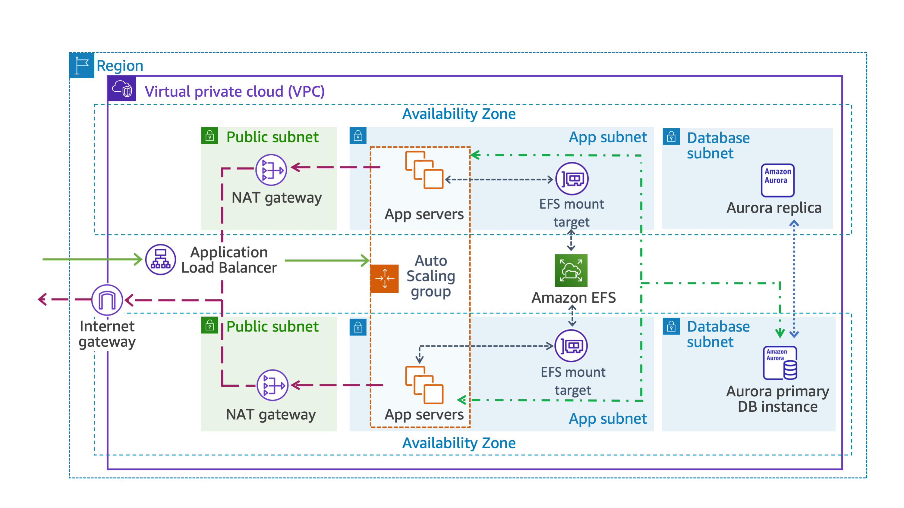

[](./)
[](http://hits.dwyl.com/HarrierPanels/AWS)
<br>
## Deploy https://github.com/FaztWeb/php-mysql-crud using CloudFormation for an AWS multi-tier architecture as follows:

- Create a VPC.
- Create an Application Load Balancer.
- The balancer must be accessible from the Internet, but limited to certain IP addresses (85.223.209.18 EPAM VPN (vpn-ua.epam.com) and Home IP 44.195.37.94)
- One Listener listens at 80 and redirects to HTTPS<sup>[x]</sup>
- The second Listener listens to 443 and redirects everything to the target group<sup>[x]</sup>
- targets created by Auto Scaling Group
- Instances are created on a private subnet
- Unhealthy instances of the target group should be replaced with new ones
- When the number of requests increases to more than 10 per instance, increase the number of instances in the group. Maximum 3. And accordingly reduce when the “load” drops
- The project code must be on S3
- S3 bucket is not public
- Database in RDS. RDS has its own security group with access only to machines with Auto Scaling Group.
- Create a Mentor User in IAM so you he check it up
- DNS name for load balancer, managed via Route53<sup>[x]</sup>
- working HTTPS certificate managed via Certificate Manager<sup>[x]</sup>
[](./crud-multi-tier.png)
#### Create private S3 with necessary yaml files
```
[ec2-user@ip-10-0-0-218 ~]$ aws s3api create-bucket --bucket aws-task-1 --acl private
{
    "Location": "/aws-task-1"
}
[ec2-user@ip-10-0-0-218 ~]$ aws s3 cp vpc-stack.yaml s3://aws-task-1/
upload: ./vpc-stack.yaml to s3://aws-task-1/vpc-stack.yaml
[ec2-user@ip-10-0-0-218 ~]$ aws s3 cp crud-stack.yaml s3://aws-task-1/
upload: ./crud-stack.yaml to s3://aws-task-1/crud-stack.yaml
[ec2-user@ip-10-0-0-218 ~]$ aws s3api get-bucket-policy --bucket aws-task-1 --query Policy | jq -r 'fromjson | {Version: .Version, Statement: .Statement}'
{
  "Version": "2012-10-17",
  "Statement": [
    {
      "Effect": "Allow",
      "Principal": {
        "Service": "cloudformation.amazonaws.com"
      },
      "Action": [
        "s3:GetObject",
        "s3:ListBucket"
      ],
      "Resource": [
        "arn:aws:s3:::aws-task-1/*",
        "arn:aws:s3:::aws-task-1"
      ]
    }
  ]
}
```
#### AWS template to build VPC and a basic networking structure with Security groups.
[vpc-stack.yaml](./vpc-stack.yaml)
```
[ec2-user@ip-10-0-0-218 ~]$ aws ec2 describe-vpcs
{
    "Vpcs": [
        {
            "CidrBlock": "172.31.0.0/16",
            "DhcpOptionsId": "dopt-02b260c6a6d8347d2",
            "State": "available",
            "VpcId": "vpc-0177e152f6eb20b5d",
            "OwnerId": "361478966802",
            "InstanceTenancy": "default",
            "CidrBlockAssociationSet": [
                {
                    "AssociationId": "vpc-cidr-assoc-06d9476e0453ea523",
                    "CidrBlock": "172.31.0.0/16",
                    "CidrBlockState": {
                        "State": "associated"
                    }
                }
            ],
            "IsDefault": true
        },
        {
            "CidrBlock": "10.0.0.0/16",
            "DhcpOptionsId": "dopt-02b260c6a6d8347d2",
            "State": "available",
            "VpcId": "vpc-08e08af719ec592a2",
            "OwnerId": "361478966802",
            "InstanceTenancy": "default",
            "CidrBlockAssociationSet": [
                {
                    "AssociationId": "vpc-cidr-assoc-0b89a3b489593d6dd",
                    "CidrBlock": "10.0.0.0/16",
                    "CidrBlockState": {
                        "State": "associated"
                    }
                }
            ],
            "IsDefault": false,
            "Tags": [
                {
                    "Key": "aws:cloudformation:logical-id",
                    "Value": "AWSTaskVPC"
                },
                {
                    "Key": "aws:cloudformation:stack-id",
                    "Value": "arn:aws:cloudformation:us-east-1:361478966802:stack/vpc-stack/757f0ed0-7f26-11ee-bb66-0e5128a34901"
                },
                {
                    "Key": "aws:cloudformation:stack-name",
                    "Value": "vpc-stack"
                },
                {
                    "Key": "Name",
                    "Value": "AWSTaskVPC"
                }
            ]
        }
    ]
}

[ec2-user@ip-10-0-0-218 ~]$ aws ec2 describe-subnets --filters "Name=vpc-id,Values=vpc-08e08af719ec592a2"
{
    "Subnets": [
        {
            "AvailabilityZone": "us-east-1a",
            "AvailabilityZoneId": "use1-az1",
            "AvailableIpAddressCount": 248,
            "CidrBlock": "10.0.0.0/24",
            "DefaultForAz": false,
            "MapPublicIpOnLaunch": true,
            "MapCustomerOwnedIpOnLaunch": false,
            "State": "available",
            "SubnetId": "subnet-0310cca42357a59fd",
            "VpcId": "vpc-08e08af719ec592a2",
            "OwnerId": "361478966802",
            "AssignIpv6AddressOnCreation": false,
            "Ipv6CidrBlockAssociationSet": [],
            "Tags": [
                {
                    "Key": "aws:cloudformation:logical-id",
                    "Value": "PublicSubnet1"
                },
                {
                    "Key": "Name",
                    "Value": "PublicSubnet1"
                },
                {
                    "Key": "aws:cloudformation:stack-id",
                    "Value": "arn:aws:cloudformation:us-east-1:361478966802:stack/vpc-stack/757f0ed0-7f26-11ee-bb66-0e5128a34901"
                },
                {
                    "Key": "aws:cloudformation:stack-name",
                    "Value": "vpc-stack"
                }
            ],
            "SubnetArn": "arn:aws:ec2:us-east-1:361478966802:subnet/subnet-0310cca42357a59fd",
            "EnableDns64": false,
            "Ipv6Native": false,
            "PrivateDnsNameOptionsOnLaunch": {
                "HostnameType": "ip-name",
                "EnableResourceNameDnsARecord": false,
                "EnableResourceNameDnsAAAARecord": false
            }
        },
        {
            "AvailabilityZone": "us-east-1a",
            "AvailabilityZoneId": "use1-az1",
            "AvailableIpAddressCount": 250,
            "CidrBlock": "10.0.4.0/24",
            "DefaultForAz": false,
            "MapPublicIpOnLaunch": false,
            "MapCustomerOwnedIpOnLaunch": false,
            "State": "available",
            "SubnetId": "subnet-01c655df70d28d73b",
            "VpcId": "vpc-08e08af719ec592a2",
            "OwnerId": "361478966802",
            "AssignIpv6AddressOnCreation": false,
            "Ipv6CidrBlockAssociationSet": [],
            "Tags": [
                {
                    "Key": "Name",
                    "Value": "DatabaseSubnet1"
                },
                {
                    "Key": "aws:cloudformation:stack-name",
                    "Value": "vpc-stack"
                },
                {
                    "Key": "aws:cloudformation:logical-id",
                    "Value": "DatabaseSubnet1"
                },
                {
                    "Key": "aws:cloudformation:stack-id",
                    "Value": "arn:aws:cloudformation:us-east-1:361478966802:stack/vpc-stack/757f0ed0-7f26-11ee-bb66-0e5128a34901"
                }
            ],
            "SubnetArn": "arn:aws:ec2:us-east-1:361478966802:subnet/subnet-01c655df70d28d73b",
            "EnableDns64": false,
            "Ipv6Native": false,
            "PrivateDnsNameOptionsOnLaunch": {
                "HostnameType": "ip-name",
                "EnableResourceNameDnsARecord": false,
                "EnableResourceNameDnsAAAARecord": false
            }
        },
        {
            "AvailabilityZone": "us-east-1a",
            "AvailabilityZoneId": "use1-az1",
            "AvailableIpAddressCount": 249,
            "CidrBlock": "10.0.2.0/24",
            "DefaultForAz": false,
            "MapPublicIpOnLaunch": false,
            "MapCustomerOwnedIpOnLaunch": false,
            "State": "available",
            "SubnetId": "subnet-04eb20b7d7ed0944d",
            "VpcId": "vpc-08e08af719ec592a2",
            "OwnerId": "361478966802",
            "AssignIpv6AddressOnCreation": false,
            "Ipv6CidrBlockAssociationSet": [],
            "Tags": [
                {
                    "Key": "Name",
                    "Value": "AppSubnet1"
                },
                {
                    "Key": "aws:cloudformation:logical-id",
                    "Value": "AppSubnet1"
                },
                {
                    "Key": "aws:cloudformation:stack-id",
                    "Value": "arn:aws:cloudformation:us-east-1:361478966802:stack/vpc-stack/757f0ed0-7f26-11ee-bb66-0e5128a34901"
                },
                {
                    "Key": "aws:cloudformation:stack-name",
                    "Value": "vpc-stack"
                }
            ],
            "SubnetArn": "arn:aws:ec2:us-east-1:361478966802:subnet/subnet-04eb20b7d7ed0944d",
            "EnableDns64": false,
            "Ipv6Native": false,
            "PrivateDnsNameOptionsOnLaunch": {
                "HostnameType": "ip-name",
                "EnableResourceNameDnsARecord": false,
                "EnableResourceNameDnsAAAARecord": false
            }
        },
        {
            "AvailabilityZone": "us-east-1b",
            "AvailabilityZoneId": "use1-az2",
            "AvailableIpAddressCount": 250,
            "CidrBlock": "10.0.5.0/24",
            "DefaultForAz": false,
            "MapPublicIpOnLaunch": false,
            "MapCustomerOwnedIpOnLaunch": false,
            "State": "available",
            "SubnetId": "subnet-01f51c4e9bf4ed2f8",
            "VpcId": "vpc-08e08af719ec592a2",
            "OwnerId": "361478966802",
            "AssignIpv6AddressOnCreation": false,
            "Ipv6CidrBlockAssociationSet": [],
            "Tags": [
                {
                    "Key": "aws:cloudformation:stack-name",
                    "Value": "vpc-stack"
                },
                {
                    "Key": "aws:cloudformation:stack-id",
                    "Value": "arn:aws:cloudformation:us-east-1:361478966802:stack/vpc-stack/757f0ed0-7f26-11ee-bb66-0e5128a34901"
                },
                {
                    "Key": "Name",
                    "Value": "DatabaseSubnet2"
                },
                {
                    "Key": "aws:cloudformation:logical-id",
                    "Value": "DatabaseSubnet2"
                }
            ],
            "SubnetArn": "arn:aws:ec2:us-east-1:361478966802:subnet/subnet-01f51c4e9bf4ed2f8",
            "EnableDns64": false,
            "Ipv6Native": false,
            "PrivateDnsNameOptionsOnLaunch": {
                "HostnameType": "ip-name",
                "EnableResourceNameDnsARecord": false,
                "EnableResourceNameDnsAAAARecord": false
            }
        },
        {
            "AvailabilityZone": "us-east-1b",
            "AvailabilityZoneId": "use1-az2",
            "AvailableIpAddressCount": 249,
            "CidrBlock": "10.0.3.0/24",
            "DefaultForAz": false,
            "MapPublicIpOnLaunch": false,
            "MapCustomerOwnedIpOnLaunch": false,
            "State": "available",
            "SubnetId": "subnet-06809f1194e68840c",
            "VpcId": "vpc-08e08af719ec592a2",
            "OwnerId": "361478966802",
            "AssignIpv6AddressOnCreation": false,
            "Ipv6CidrBlockAssociationSet": [],
            "Tags": [
                {
                    "Key": "aws:cloudformation:logical-id",
                    "Value": "AppSubnet2"
                },
                {
                    "Key": "aws:cloudformation:stack-id",
                    "Value": "arn:aws:cloudformation:us-east-1:361478966802:stack/vpc-stack/757f0ed0-7f26-11ee-bb66-0e5128a34901"
                },
                {
                    "Key": "Name",
                    "Value": "AppSubnet2"
                },
                {
                    "Key": "aws:cloudformation:stack-name",
                    "Value": "vpc-stack"
                }
            ],
            "SubnetArn": "arn:aws:ec2:us-east-1:361478966802:subnet/subnet-06809f1194e68840c",
            "EnableDns64": false,
            "Ipv6Native": false,
            "PrivateDnsNameOptionsOnLaunch": {
                "HostnameType": "ip-name",
                "EnableResourceNameDnsARecord": false,
                "EnableResourceNameDnsAAAARecord": false
            }
        },
        {
            "AvailabilityZone": "us-east-1b",
            "AvailabilityZoneId": "use1-az2",
            "AvailableIpAddressCount": 249,
            "CidrBlock": "10.0.1.0/24",
            "DefaultForAz": false,
            "MapPublicIpOnLaunch": true,
            "MapCustomerOwnedIpOnLaunch": false,
            "State": "available",
            "SubnetId": "subnet-0157b489891a646b9",
            "VpcId": "vpc-08e08af719ec592a2",
            "OwnerId": "361478966802",
            "AssignIpv6AddressOnCreation": false,
            "Ipv6CidrBlockAssociationSet": [],
            "Tags": [
                {
                    "Key": "aws:cloudformation:stack-id",
                    "Value": "arn:aws:cloudformation:us-east-1:361478966802:stack/vpc-stack/757f0ed0-7f26-11ee-bb66-0e5128a34901"
                },
                {
                    "Key": "aws:cloudformation:stack-name",
                    "Value": "vpc-stack"
                },
                {
                    "Key": "aws:cloudformation:logical-id",
                    "Value": "PublicSubnet2"
                },
                {
                    "Key": "Name",
                    "Value": "PublicSubnet2"
                }
            ],
            "SubnetArn": "arn:aws:ec2:us-east-1:361478966802:subnet/subnet-0157b489891a646b9",
            "EnableDns64": false,
            "Ipv6Native": false,
            "PrivateDnsNameOptionsOnLaunch": {
                "HostnameType": "ip-name",
                "EnableResourceNameDnsARecord": false,
                "EnableResourceNameDnsAAAARecord": false
            }
        }
    ]
}

[ec2-user@ip-10-0-0-218 ~]$ aws ec2 describe-security-groups --filters "Name=vpc-id,Values=vpc-08e08af719ec592a2"
{
    "SecurityGroups": [
        {
            "Description": "default VPC security group",
            "GroupName": "default",
            "IpPermissions": [
                {
                    "IpProtocol": "-1",
                    "IpRanges": [],
                    "Ipv6Ranges": [],
                    "PrefixListIds": [],
                    "UserIdGroupPairs": [
                        {
                            "GroupId": "sg-0d6d8a285ecee1c7c",
                            "UserId": "361478966802"
                        }
                    ]
                }
            ],
            "OwnerId": "361478966802",
            "GroupId": "sg-0d6d8a285ecee1c7c",
            "IpPermissionsEgress": [
                {
                    "IpProtocol": "-1",
                    "IpRanges": [
                        {
                            "CidrIp": "0.0.0.0/0"
                        }
                    ],
                    "Ipv6Ranges": [],
                    "PrefixListIds": [],
                    "UserIdGroupPairs": []
                }
            ],
            "VpcId": "vpc-08e08af719ec592a2"
        },
        {
            "Description": "Security Group allowing HTTP traffic for AWS Task instances",
            "GroupName": "vpc-stack-AppInstanceSecurityGroup-45FU15XLT0JE",
            "IpPermissions": [
                {
                    "FromPort": 80,
                    "IpProtocol": "tcp",
                    "IpRanges": [
                        {
                            "CidrIp": "85.223.209.18/32"
                        },
                        {
                            "CidrIp": "44.195.37.94/32"
                        }
                    ],
                    "Ipv6Ranges": [],
                    "PrefixListIds": [],
                    "ToPort": 80,
                    "UserIdGroupPairs": []
                }
            ],
            "OwnerId": "361478966802",
            "GroupId": "sg-0d9c6cc10a9aba741",
            "IpPermissionsEgress": [
                {
                    "IpProtocol": "-1",
                    "IpRanges": [
                        {
                            "CidrIp": "0.0.0.0/0"
                        }
                    ],
                    "Ipv6Ranges": [],
                    "PrefixListIds": [],
                    "UserIdGroupPairs": []
                }
            ],
            "Tags": [
                {
                    "Key": "Name",
                    "Value": "AppInstanceSecurityGroup"
                },
                {
                    "Key": "aws:cloudformation:logical-id",
                    "Value": "AppInstanceSecurityGroup"
                },
                {
                    "Key": "aws:cloudformation:stack-id",
                    "Value": "arn:aws:cloudformation:us-east-1:361478966802:stack/vpc-stack/757f0ed0-7f26-11ee-bb66-0e5128a34901"
                },
                {
                    "Key": "aws:cloudformation:stack-name",
                    "Value": "vpc-stack"
                }
            ],
            "VpcId": "vpc-08e08af719ec592a2"
        },
        {
            "Description": "Security Group allowing traffic between EFS Mount Targets and Amazon EC2 instances",
            "GroupName": "vpc-stack-EFSMountTargetSecurityGroup-LCZHAYWBGGNL",
            "IpPermissions": [
                {
                    "FromPort": 80,
                    "IpProtocol": "tcp",
                    "IpRanges": [],
                    "Ipv6Ranges": [],
                    "PrefixListIds": [],
                    "ToPort": 80,
                    "UserIdGroupPairs": [
                        {
                            "GroupId": "sg-0d9c6cc10a9aba741",
                            "UserId": "361478966802"
                        }
                    ]
                },
                {
                    "FromPort": 2049,
                    "IpProtocol": "tcp",
                    "IpRanges": [],
                    "Ipv6Ranges": [],
                    "PrefixListIds": [],
                    "ToPort": 2049,
                    "UserIdGroupPairs": [
                        {
                            "GroupId": "sg-0912a960272744ade",
                            "UserId": "361478966802"
                        }
                    ]
                }
            ],
            "OwnerId": "361478966802",
            "GroupId": "sg-0e66c9d5a99f6f055",
            "IpPermissionsEgress": [
                {
                    "IpProtocol": "-1",
                    "IpRanges": [
                        {
                            "CidrIp": "0.0.0.0/0"
                        }
                    ],
                    "Ipv6Ranges": [],
                    "PrefixListIds": [],
                    "UserIdGroupPairs": []
                }
            ],
            "Tags": [
                {
                    "Key": "aws:cloudformation:logical-id",
                    "Value": "EFSMountTargetSecurityGroup"
                },
                {
                    "Key": "aws:cloudformation:stack-name",
                    "Value": "vpc-stack"
                },
                {
                    "Key": "aws:cloudformation:stack-id",
                    "Value": "arn:aws:cloudformation:us-east-1:361478966802:stack/vpc-stack/757f0ed0-7f26-11ee-bb66-0e5128a34901"
                },
                {
                    "Key": "Name",
                    "Value": "EFSMountTargetSecurityGroup"
                }
            ],
            "VpcId": "vpc-08e08af719ec592a2"
        },
        {
            "Description": "Security Group allowing RDS instances to have internet traffic",
            "GroupName": "vpc-stack-RDSSecurityGroup-18DZSER41VM4T",
            "IpPermissions": [
                {
                    "FromPort": 3306,
                    "IpProtocol": "tcp",
                    "IpRanges": [],
                    "Ipv6Ranges": [],
                    "PrefixListIds": [],
                    "ToPort": 3306,
                    "UserIdGroupPairs": [
                        {
                            "GroupId": "sg-0912a960272744ade",
                            "UserId": "361478966802"
                        }
                    ]
                }
            ],
            "OwnerId": "361478966802",
            "GroupId": "sg-0f4961c511b173019",
            "IpPermissionsEgress": [
                {
                    "IpProtocol": "-1",
                    "IpRanges": [
                        {
                            "CidrIp": "0.0.0.0/0"
                        }
                    ],
                    "Ipv6Ranges": [],
                    "PrefixListIds": [],
                    "UserIdGroupPairs": []
                }
            ],
            "Tags": [
                {
                    "Key": "Name",
                    "Value": "RDSSecurityGroup"
                },
                {
                    "Key": "aws:cloudformation:logical-id",
                    "Value": "RDSSecurityGroup"
                },
                {
                    "Key": "aws:cloudformation:stack-name",
                    "Value": "vpc-stack"
                },
                {
                    "Key": "aws:cloudformation:stack-id",
                    "Value": "arn:aws:cloudformation:us-east-1:361478966802:stack/vpc-stack/757f0ed0-7f26-11ee-bb66-0e5128a34901"
                }
            ],
            "VpcId": "vpc-08e08af719ec592a2"
        },
        {
            "Description": "Security group for web instances",
            "GroupName": "CRUD Servers Security Group",
            "IpPermissions": [
                {
                    "FromPort": 80,
                    "IpProtocol": "tcp",
                    "IpRanges": [],
                    "Ipv6Ranges": [],
                    "PrefixListIds": [],
                    "ToPort": 80,
                    "UserIdGroupPairs": [
                        {
                            "GroupId": "sg-0d9c6cc10a9aba741",
                            "UserId": "361478966802"
                        }
                    ]
                }
            ],
            "OwnerId": "361478966802",
            "GroupId": "sg-0912a960272744ade",
            "IpPermissionsEgress": [
                {
                    "IpProtocol": "-1",
                    "IpRanges": [
                        {
                            "CidrIp": "0.0.0.0/0"
                        }
                    ],
                    "Ipv6Ranges": [],
                    "PrefixListIds": [],
                    "UserIdGroupPairs": []
                }
            ],
            "Tags": [
                {
                    "Key": "aws:cloudformation:logical-id",
                    "Value": "WebTierSecurityGroup"
                },
                {
                    "Key": "aws:cloudformation:stack-name",
                    "Value": "crud-stack"
                },
                {
                    "Key": "aws:cloudformation:stack-id",
                    "Value": "arn:aws:cloudformation:us-east-1:361478966802:stack/crud-stack/3c7c5800-7f2a-11ee-8474-0a3aba329a79"
                }
            ],
            "VpcId": "vpc-08e08af719ec592a2"
        }
    ]
}

[ec2-user@ip-10-0-0-218 ~]$ aws ec2 describe-nat-gateways --filter "Name=vpc-id,Values=vpc-08e08af719ec592a2"
{
    "NatGateways": [
        {
            "CreateTime": "2023-11-09T17:36:31+00:00",
            "NatGatewayAddresses": [
                {
                    "AllocationId": "eipalloc-0a5d701aaf9e907d3",
                    "NetworkInterfaceId": "eni-0dd32fc255c7c314f",
                    "PrivateIp": "10.0.0.47",
                    "PublicIp": "44.212.158.54"
                }
            ],
            "NatGatewayId": "nat-0d48aa4b14e7f4a82",
            "State": "available",
            "SubnetId": "subnet-0310cca42357a59fd",
            "VpcId": "vpc-08e08af719ec592a2",
            "Tags": [
                {
                    "Key": "aws:cloudformation:stack-name",
                    "Value": "vpc-stack"
                },
                {
                    "Key": "aws:cloudformation:logical-id",
                    "Value": "NATGateway1"
                },
                {
                    "Key": "aws:cloudformation:stack-id",
                    "Value": "arn:aws:cloudformation:us-east-1:361478966802:stack/vpc-stack/757f0ed0-7f26-11ee-bb66-0e5128a34901"
                },
                {
                    "Key": "Name",
                    "Value": "NATGateway1"
                }
            ],
            "ConnectivityType": "public"
        },
        {
            "CreateTime": "2023-11-09T17:36:31+00:00",
            "NatGatewayAddresses": [
                {
                    "AllocationId": "eipalloc-070ed292a8f75ed20",
                    "NetworkInterfaceId": "eni-057e09e03c061ea27",
                    "PrivateIp": "10.0.1.110",
                    "PublicIp": "52.206.43.251"
                }
            ],
            "NatGatewayId": "nat-0cf4b4211088884a0",
            "State": "available",
            "SubnetId": "subnet-0157b489891a646b9",
            "VpcId": "vpc-08e08af719ec592a2",
            "Tags": [
                {
                    "Key": "aws:cloudformation:stack-name",
                    "Value": "vpc-stack"
                },
                {
                    "Key": "aws:cloudformation:logical-id",
                    "Value": "NATGateway2"
                },
                {
                    "Key": "aws:cloudformation:stack-id",
                    "Value": "arn:aws:cloudformation:us-east-1:361478966802:stack/vpc-stack/757f0ed0-7f26-11ee-bb66-0e5128a34901"
                },
                {
                    "Key": "Name",
                    "Value": "NATGateway2"
                }
            ],
            "ConnectivityType": "public"
        }
    ]
}

[ec2-user@ip-10-0-0-218 ~]$ aws ec2 describe-internet-gateways --filters "Name=attachment.vpc-id,Values=vpc-08e08af719ec592a2"
{
    "InternetGateways": [
        {
            "Attachments": [
                {
                    "State": "available",
                    "VpcId": "vpc-08e08af719ec592a2"
                }
            ],
            "InternetGatewayId": "igw-0148c943f4616d166",
            "OwnerId": "361478966802",
            "Tags": [
                {
                    "Key": "aws:cloudformation:logical-id",
                    "Value": "AWSTaskInternetGateway"
                },
                {
                    "Key": "aws:cloudformation:stack-id",
                    "Value": "arn:aws:cloudformation:us-east-1:361478966802:stack/vpc-stack/757f0ed0-7f26-11ee-bb66-0e5128a34901"
                },
                {
                    "Key": "aws:cloudformation:stack-name",
                    "Value": "vpc-stack"
                }
            ]
        }
    ]
}

[ec2-user@ip-10-0-0-218 ~]$ aws ec2 describe-route-tables --filters "Name=vpc-id,Values=vpc-08e08af719ec592a2"
{
    "RouteTables": [
        {
            "Associations": [
                {
                    "Main": true,
                    "RouteTableAssociationId": "rtbassoc-04afd8da8fdb218cd",
                    "RouteTableId": "rtb-01b7ef415c4589fc6",
                    "AssociationState": {
                        "State": "associated"
                    }
                }
            ],
            "PropagatingVgws": [],
            "RouteTableId": "rtb-01b7ef415c4589fc6",
            "Routes": [
                {
                    "DestinationCidrBlock": "10.0.0.0/16",
                    "GatewayId": "local",
                    "Origin": "CreateRouteTable",
                    "State": "active"
                }
            ],
            "Tags": [],
            "VpcId": "vpc-08e08af719ec592a2",
            "OwnerId": "361478966802"
        },
        {
            "Associations": [
                {
                    "Main": false,
                    "RouteTableAssociationId": "rtbassoc-039203ff96836ddb8",
                    "RouteTableId": "rtb-0ef3603f8857e213a",
                    "SubnetId": "subnet-0310cca42357a59fd",
                    "AssociationState": {
                        "State": "associated"
                    }
                },
                {
                    "Main": false,
                    "RouteTableAssociationId": "rtbassoc-08d0d3244058776b5",
                    "RouteTableId": "rtb-0ef3603f8857e213a",
                    "SubnetId": "subnet-0157b489891a646b9",
                    "AssociationState": {
                        "State": "associated"
                    }
                }
            ],
            "PropagatingVgws": [],
            "RouteTableId": "rtb-0ef3603f8857e213a",
            "Routes": [
                {
                    "DestinationCidrBlock": "10.0.0.0/16",
                    "GatewayId": "local",
                    "Origin": "CreateRouteTable",
                    "State": "active"
                },
                {
                    "DestinationCidrBlock": "0.0.0.0/0",
                    "GatewayId": "igw-0148c943f4616d166",
                    "Origin": "CreateRoute",
                    "State": "active"
                }
            ],
            "Tags": [
                {
                    "Key": "aws:cloudformation:stack-name",
                    "Value": "vpc-stack"
                },
                {
                    "Key": "aws:cloudformation:stack-id",
                    "Value": "arn:aws:cloudformation:us-east-1:361478966802:stack/vpc-stack/757f0ed0-7f26-11ee-bb66-0e5128a34901"
                },
                {
                    "Key": "Name",
                    "Value": "PublicRouteTable"
                },
                {
                    "Key": "aws:cloudformation:logical-id",
                    "Value": "PublicRouteTable"
                }
            ],
            "VpcId": "vpc-08e08af719ec592a2",
            "OwnerId": "361478966802"
        },
        {
            "Associations": [
                {
                    "Main": false,
                    "RouteTableAssociationId": "rtbassoc-0da32c7219ae3471c",
                    "RouteTableId": "rtb-0756e3c204341b5f3",
                    "SubnetId": "subnet-01c655df70d28d73b",
                    "AssociationState": {
                        "State": "associated"
                    }
                },
                {
                    "Main": false,
                    "RouteTableAssociationId": "rtbassoc-0ec9cf0c1b5eaa5a0",
                    "RouteTableId": "rtb-0756e3c204341b5f3",
                    "SubnetId": "subnet-04eb20b7d7ed0944d",
                    "AssociationState": {
                        "State": "associated"
                    }
                }
            ],
            "PropagatingVgws": [],
            "RouteTableId": "rtb-0756e3c204341b5f3",
            "Routes": [
                {
                    "DestinationCidrBlock": "10.0.0.0/16",
                    "GatewayId": "local",
                    "Origin": "CreateRouteTable",
                    "State": "active"
                },
                {
                    "DestinationCidrBlock": "0.0.0.0/0",
                    "NatGatewayId": "nat-0d48aa4b14e7f4a82",
                    "Origin": "CreateRoute",
                    "State": "active"
                }
            ],
            "Tags": [
                {
                    "Key": "Name",
                    "Value": "PrivateRouteTableAZ1"
                },
                {
                    "Key": "aws:cloudformation:logical-id",
                    "Value": "PrivateRouteTableAZ1"
                },
                {
                    "Key": "aws:cloudformation:stack-name",
                    "Value": "vpc-stack"
                },
                {
                    "Key": "aws:cloudformation:stack-id",
                    "Value": "arn:aws:cloudformation:us-east-1:361478966802:stack/vpc-stack/757f0ed0-7f26-11ee-bb66-0e5128a34901"
                }
            ],
            "VpcId": "vpc-08e08af719ec592a2",
            "OwnerId": "361478966802"
        },
        {
            "Associations": [
                {
                    "Main": false,
                    "RouteTableAssociationId": "rtbassoc-0a2777d1fa94c1347",
                    "RouteTableId": "rtb-074ba8e3562df413b",
                    "SubnetId": "subnet-01f51c4e9bf4ed2f8",
                    "AssociationState": {
                        "State": "associated"
                    }
                },
                {
                    "Main": false,
                    "RouteTableAssociationId": "rtbassoc-0a95f960810ecc232",
                    "RouteTableId": "rtb-074ba8e3562df413b",
                    "SubnetId": "subnet-06809f1194e68840c",
                    "AssociationState": {
                        "State": "associated"
                    }
                }
            ],
            "PropagatingVgws": [],
            "RouteTableId": "rtb-074ba8e3562df413b",
            "Routes": [
                {
                    "DestinationCidrBlock": "10.0.0.0/16",
                    "GatewayId": "local",
                    "Origin": "CreateRouteTable",
                    "State": "active"
                },
                {
                    "DestinationCidrBlock": "0.0.0.0/0",
                    "NatGatewayId": "nat-0cf4b4211088884a0",
                    "Origin": "CreateRoute",
                    "State": "active"
                }
            ],
            "Tags": [
                {
                    "Key": "Name",
                    "Value": "PrivateRouteTableAZ2"
                },
                {
                    "Key": "aws:cloudformation:logical-id",
                    "Value": "PrivateRouteTableAZ2"
                },
                {
                    "Key": "aws:cloudformation:stack-name",
                    "Value": "vpc-stack"
                },
                {
                    "Key": "aws:cloudformation:stack-id",
                    "Value": "arn:aws:cloudformation:us-east-1:361478966802:stack/vpc-stack/757f0ed0-7f26-11ee-bb66-0e5128a34901"
                }
            ],
            "VpcId": "vpc-08e08af719ec592a2",
            "OwnerId": "361478966802"
        }
    ]
}
```

#### RDS. Create Multi-AZ DB subnet group & cluster
[subnet-group.yaml](./subnet-group.yaml)
[db-cluster.yaml](./db-cluster.yaml)
```
[ec2-user@ip-10-0-0-218 ~]$ aws rds describe-db-clusters --query 'DBClusters[*].DBClusterIdentifier'
[
    "cruddbcluster"
]
[ec2-user@ip-10-0-0-218 ~]$ aws rds describe-db-clusters --db-cluster-identifier cruddbcluster --query 'DBClusters[0].DBSubnetGroup'
"cruddbsubnetgroup"
[ec2-user@ip-10-0-0-218 ~]$ aws rds describe-db-subnet-groups --db-subnet-group-name cruddbsubnetgroup
{
    "DBSubnetGroups": [
        {
            "DBSubnetGroupName": "cruddbsubnetgroup",
            "DBSubnetGroupDescription": "2AZ group",
            "VpcId": "vpc-08e08af719ec592a2",
            "SubnetGroupStatus": "Complete",
            "Subnets": [
                {
                    "SubnetIdentifier": "subnet-01c655df70d28d73b",
                    "SubnetAvailabilityZone": {
                        "Name": "us-east-1a"
                    },
                    "SubnetOutpost": {},
                    "SubnetStatus": "Active"
                },
                {
                    "SubnetIdentifier": "subnet-01f51c4e9bf4ed2f8",
                    "SubnetAvailabilityZone": {
                        "Name": "us-east-1b"
                    },
                    "SubnetOutpost": {},
                    "SubnetStatus": "Active"
                }
            ],
            "DBSubnetGroupArn": "arn:aws:rds:us-east-1:361478966802:subgrp:cruddbsubnetgroup",
            "SupportedNetworkTypes": [
                "IPV4"
            ]
        }
    ]
}

[ec2-user@ip-10-0-0-218 ~]$ aws rds describe-db-instances
{
    "DBInstances": [
        {
            "DBInstanceIdentifier": "cruddbcluster-instance-1",
            "DBInstanceClass": "db.t3.medium",
            "Engine": "aurora-mysql",
            "DBInstanceStatus": "available",
            "MasterUsername": "admin",
            "DBName": "phpcrud",
            "Endpoint": {
                "Address": "cruddbcluster-instance-1.ciyu1sj8fkur.us-east-1.rds.amazonaws.com",
                "Port": 3306,
                "HostedZoneId": "Z2R2ITUGPM61AM"
            },
            "AllocatedStorage": 1,
            "InstanceCreateTime": "2023-11-09T17:52:14.702000+00:00",
            "PreferredBackupWindow": "03:47-04:17",
            "BackupRetentionPeriod": 1,
            "DBSecurityGroups": [],
            "VpcSecurityGroups": [
                {
                    "VpcSecurityGroupId": "sg-0f4961c511b173019",
                    "Status": "active"
                }
            ],
            "DBParameterGroups": [
                {
                    "DBParameterGroupName": "default.aurora-mysql8.0",
                    "ParameterApplyStatus": "in-sync"
                }
            ],
            "AvailabilityZone": "us-east-1a",
            "DBSubnetGroup": {
                "DBSubnetGroupName": "cruddbsubnetgroup",
                "DBSubnetGroupDescription": "2AZ group",
                "VpcId": "vpc-08e08af719ec592a2",
                "SubnetGroupStatus": "Complete",
                "Subnets": [
                    {
                        "SubnetIdentifier": "subnet-01c655df70d28d73b",
                        "SubnetAvailabilityZone": {
                            "Name": "us-east-1a"
                        },
                        "SubnetOutpost": {},
                        "SubnetStatus": "Active"
                    },
                    {
                        "SubnetIdentifier": "subnet-01f51c4e9bf4ed2f8",
                        "SubnetAvailabilityZone": {
                            "Name": "us-east-1b"
                        },
                        "SubnetOutpost": {},
                        "SubnetStatus": "Active"
                    }
                ]
            },
            "PreferredMaintenanceWindow": "sat:03:38-sat:04:08",
            "PendingModifiedValues": {},
            "MultiAZ": false,
            "EngineVersion": "8.0.mysql_aurora.3.04.0",
            "AutoMinorVersionUpgrade": false,
            "ReadReplicaDBInstanceIdentifiers": [],
            "LicenseModel": "general-public-license",
            "OptionGroupMemberships": [
                {
                    "OptionGroupName": "default:aurora-mysql-8-0",
                    "Status": "in-sync"
                }
            ],
            "PubliclyAccessible": false,
            "StorageType": "aurora",
            "DbInstancePort": 0,
            "DBClusterIdentifier": "cruddbcluster",
            "StorageEncrypted": false,
            "DbiResourceId": "db-LQ2YADVXHYYHOXCI6NH6VSX3VA",
            "CACertificateIdentifier": "rds-ca-2019",
            "DomainMemberships": [],
            "CopyTagsToSnapshot": false,
            "MonitoringInterval": 0,
            "PromotionTier": 1,
            "DBInstanceArn": "arn:aws:rds:us-east-1:361478966802:db:cruddbcluster-instance-1",
            "IAMDatabaseAuthenticationEnabled": false,
            "PerformanceInsightsEnabled": false,
            "DeletionProtection": false,
            "AssociatedRoles": [],
            "TagList": [],
            "CustomerOwnedIpEnabled": false,
            "BackupTarget": "region",
            "NetworkType": "IPV4",
            "StorageThroughput": 0,
            "CertificateDetails": {
                "CAIdentifier": "rds-ca-2019",
                "ValidTill": "2024-08-22T17:08:50+00:00"
            }
        },
        {
            "DBInstanceIdentifier": "cruddbcluster-instance-1-us-east-1b",
            "DBInstanceClass": "db.t3.medium",
            "Engine": "aurora-mysql",
            "DBInstanceStatus": "available",
            "MasterUsername": "admin",
            "DBName": "phpcrud",
            "Endpoint": {
                "Address": "cruddbcluster-instance-1-us-east-1b.ciyu1sj8fkur.us-east-1.rds.amazonaws.com",
                "Port": 3306,
                "HostedZoneId": "Z2R2ITUGPM61AM"
            },
            "AllocatedStorage": 1,
            "InstanceCreateTime": "2023-11-09T17:59:51.095000+00:00",
            "PreferredBackupWindow": "03:47-04:17",
            "BackupRetentionPeriod": 1,
            "DBSecurityGroups": [],
            "VpcSecurityGroups": [
                {
                    "VpcSecurityGroupId": "sg-0f4961c511b173019",
                    "Status": "active"
                }
            ],
            "DBParameterGroups": [
                {
                    "DBParameterGroupName": "default.aurora-mysql8.0",
                    "ParameterApplyStatus": "in-sync"
                }
            ],
            "AvailabilityZone": "us-east-1b",
            "DBSubnetGroup": {
                "DBSubnetGroupName": "cruddbsubnetgroup",
                "DBSubnetGroupDescription": "2AZ group",
                "VpcId": "vpc-08e08af719ec592a2",
                "SubnetGroupStatus": "Complete",
                "Subnets": [
                    {
                        "SubnetIdentifier": "subnet-01c655df70d28d73b",
                        "SubnetAvailabilityZone": {
                            "Name": "us-east-1a"
                        },
                        "SubnetOutpost": {},
                        "SubnetStatus": "Active"
                    },
                    {
                        "SubnetIdentifier": "subnet-01f51c4e9bf4ed2f8",
                        "SubnetAvailabilityZone": {
                            "Name": "us-east-1b"
                        },
                        "SubnetOutpost": {},
                        "SubnetStatus": "Active"
                    }
                ]
            },
            "PreferredMaintenanceWindow": "fri:07:57-fri:08:27",
            "PendingModifiedValues": {},
            "MultiAZ": false,
            "EngineVersion": "8.0.mysql_aurora.3.04.0",
            "AutoMinorVersionUpgrade": false,
            "ReadReplicaDBInstanceIdentifiers": [],
            "LicenseModel": "general-public-license",
            "OptionGroupMemberships": [
                {
                    "OptionGroupName": "default:aurora-mysql-8-0",
                    "Status": "in-sync"
                }
            ],
            "PubliclyAccessible": false,
            "StorageType": "aurora",
            "DbInstancePort": 0,
            "DBClusterIdentifier": "cruddbcluster",
            "StorageEncrypted": false,
            "DbiResourceId": "db-T4NEIIHWQ44LYICNBVTVQRGWXE",
            "CACertificateIdentifier": "rds-ca-2019",
            "DomainMemberships": [],
            "CopyTagsToSnapshot": false,
            "MonitoringInterval": 0,
            "PromotionTier": 1,
            "DBInstanceArn": "arn:aws:rds:us-east-1:361478966802:db:cruddbcluster-instance-1-us-east-1b",
            "IAMDatabaseAuthenticationEnabled": false,
            "PerformanceInsightsEnabled": false,
            "DeletionProtection": false,
            "AssociatedRoles": [],
            "TagList": [],
            "CustomerOwnedIpEnabled": false,
            "BackupTarget": "region",
            "NetworkType": "IPV4",
            "StorageThroughput": 0,
            "CertificateDetails": {
                "CAIdentifier": "rds-ca-2019",
                "ValidTill": "2024-08-22T17:08:50+00:00"
            }
        }
    ]
}

[ec2-user@ip-10-0-0-218 ~]$ aws rds describe-db-instances --db-instance-identifier cruddbcluster-instance-1
{
    "DBInstances": [
        {
            "DBInstanceIdentifier": "cruddbcluster-instance-1",
            "DBInstanceClass": "db.t3.medium",
            "Engine": "aurora-mysql",
            "DBInstanceStatus": "available",
            "MasterUsername": "admin",
            "DBName": "phpcrud",
            "Endpoint": {
                "Address": "cruddbcluster-instance-1.ciyu1sj8fkur.us-east-1.rds.amazonaws.com",
                "Port": 3306,
                "HostedZoneId": "Z2R2ITUGPM61AM"
            },
            "AllocatedStorage": 1,
            "InstanceCreateTime": "2023-11-09T17:52:14.702000+00:00",
            "PreferredBackupWindow": "03:47-04:17",
            "BackupRetentionPeriod": 1,
            "DBSecurityGroups": [],
            "VpcSecurityGroups": [
                {
                    "VpcSecurityGroupId": "sg-0f4961c511b173019",
                    "Status": "active"
                }
            ],
            "DBParameterGroups": [
                {
                    "DBParameterGroupName": "default.aurora-mysql8.0",
                    "ParameterApplyStatus": "in-sync"
                }
            ],
            "AvailabilityZone": "us-east-1a",
            "DBSubnetGroup": {
                "DBSubnetGroupName": "cruddbsubnetgroup",
                "DBSubnetGroupDescription": "2AZ group",
                "VpcId": "vpc-08e08af719ec592a2",
                "SubnetGroupStatus": "Complete",
                "Subnets": [
                    {
                        "SubnetIdentifier": "subnet-01c655df70d28d73b",
                        "SubnetAvailabilityZone": {
                            "Name": "us-east-1a"
                        },
                        "SubnetOutpost": {},
                        "SubnetStatus": "Active"
                    },
                    {
                        "SubnetIdentifier": "subnet-01f51c4e9bf4ed2f8",
                        "SubnetAvailabilityZone": {
                            "Name": "us-east-1b"
                        },
                        "SubnetOutpost": {},
                        "SubnetStatus": "Active"
                    }
                ]
            },
            "PreferredMaintenanceWindow": "sat:03:38-sat:04:08",
            "PendingModifiedValues": {},
            "MultiAZ": false,
            "EngineVersion": "8.0.mysql_aurora.3.04.0",
            "AutoMinorVersionUpgrade": false,
            "ReadReplicaDBInstanceIdentifiers": [],
            "LicenseModel": "general-public-license",
            "OptionGroupMemberships": [
                {
                    "OptionGroupName": "default:aurora-mysql-8-0",
                    "Status": "in-sync"
                }
            ],
            "PubliclyAccessible": false,
            "StorageType": "aurora",
            "DbInstancePort": 0,
            "DBClusterIdentifier": "cruddbcluster",
            "StorageEncrypted": false,
            "DbiResourceId": "db-LQ2YADVXHYYHOXCI6NH6VSX3VA",
            "CACertificateIdentifier": "rds-ca-2019",
            "DomainMemberships": [],
            "CopyTagsToSnapshot": false,
            "MonitoringInterval": 0,
            "PromotionTier": 1,
            "DBInstanceArn": "arn:aws:rds:us-east-1:361478966802:db:cruddbcluster-instance-1",
            "IAMDatabaseAuthenticationEnabled": false,
            "PerformanceInsightsEnabled": false,
            "DeletionProtection": false,
            "AssociatedRoles": [],
            "TagList": [],
            "CustomerOwnedIpEnabled": false,
            "BackupTarget": "region",
            "NetworkType": "IPV4",
            "StorageThroughput": 0,
            "CertificateDetails": {
                "CAIdentifier": "rds-ca-2019",
                "ValidTill": "2024-08-22T17:08:50+00:00"
            }
        }
    ]
}

[ec2-user@ip-10-0-0-218 ~]$ aws rds describe-db-instances --db-instance-identifier cruddbcluster-instance-1 --query 'DBInstances[*].Endpoint.Address'
[
    "cruddbcluster-instance-1.ciyu1sj8fkur.us-east-1.rds.amazonaws.com"
]
```

#### EFS.
> <sup>Amazon EFS provides a scalable, shared, and consistent file system that simplifies the management of shared storage for applications running on multiple instances. It's particularly useful for scenarios where instances need to access and modify shared data in a scalable and dynamic environment, such as a CRUD application in a cloud-based infrastructure.</sup>
[efs-stack.yaml](./efs-stack.yaml)
```
[ec2-user@ip-10-0-0-218 ~]$ aws efs describe-file-systems
{
    "FileSystems": [
        {
            "OwnerId": "361478966802",
            "CreationToken": "console-37d62765-8ded-4963-b463-1290458c7050",
            "FileSystemId": "fs-04fee41885797ed36",
            "FileSystemArn": "arn:aws:elasticfilesystem:us-east-1:361478966802:file-system/fs-04fee41885797ed36",
            "CreationTime": "2023-11-09T17:45:39+00:00",
            "LifeCycleState": "available",
            "Name": "crudEFS",
            "NumberOfMountTargets": 2,
            "SizeInBytes": {
                "Value": 120832,
                "Timestamp": "2023-11-09T22:45:34+00:00",
                "ValueInIA": 0,
                "ValueInStandard": 120832
            },
            "PerformanceMode": "generalPurpose",
            "Encrypted": false,
            "ThroughputMode": "bursting",
            "Tags": [
                {
                    "Key": "Name",
                    "Value": "crudEFS"
                }
            ]
        }
    ]
}

[ec2-user@ip-10-0-0-218 ~]$ aws efs describe-mount-targets --file-system-id fs-04fee41885797ed36
{
    "MountTargets": [
        {
            "OwnerId": "361478966802",
            "MountTargetId": "fsmt-0d6b3192a2cf3ec48",
            "FileSystemId": "fs-04fee41885797ed36",
            "SubnetId": "subnet-06809f1194e68840c",
            "LifeCycleState": "available",
            "IpAddress": "10.0.3.42",
            "NetworkInterfaceId": "eni-06dd24fc29c6bd32c",
            "AvailabilityZoneId": "use1-az2",
            "AvailabilityZoneName": "us-east-1b",
            "VpcId": "vpc-08e08af719ec592a2"
        },
        {
            "OwnerId": "361478966802",
            "MountTargetId": "fsmt-0e1e1c8e3353a9ce5",
            "FileSystemId": "fs-04fee41885797ed36",
            "SubnetId": "subnet-04eb20b7d7ed0944d",
            "LifeCycleState": "available",
            "IpAddress": "10.0.2.175",
            "NetworkInterfaceId": "eni-09efdfd06493d46b7",
            "AvailabilityZoneId": "use1-az1",
            "AvailabilityZoneName": "us-east-1a",
            "VpcId": "vpc-08e08af719ec592a2"
        }
    ]
}
```
#### Application Load Balancer with a target group  Listener for HTTP traffic on port 80. 
[crud-alb.yaml](./crud-alb.yaml)

```
[ec2-user@ip-10-0-0-218 ~]$ aws elbv2 describe-load-balancers
{
    "LoadBalancers": [
        {
            "IpAddressType": "ipv4",
            "VpcId": "vpc-08e08af719ec592a2",
            "LoadBalancerArn": "arn:aws:elasticloadbalancing:us-east-1:361478966802:loadbalancer/app/crudALB/907c6b1aa813b0da",
            "State": {
                "Code": "active"
            },
            "DNSName": "crudALB-1067167057.us-east-1.elb.amazonaws.com",
            "SecurityGroups": [
                "sg-0d9c6cc10a9aba741"
            ],
            "LoadBalancerName": "crudALB",
            "CreatedTime": "2023-11-09T17:58:55.180Z",
            "Scheme": "internet-facing",
            "Type": "application",
            "CanonicalHostedZoneId": "Z35SXDOTRQ7X7K",
            "AvailabilityZones": [
                {
                    "SubnetId": "subnet-0157b489891a646b9",
                    "LoadBalancerAddresses": [],
                    "ZoneName": "us-east-1b"
                },
                {
                    "SubnetId": "subnet-0310cca42357a59fd",
                    "LoadBalancerAddresses": [],
                    "ZoneName": "us-east-1a"
                }
            ]
        }
    ]
}

[ec2-user@ip-10-0-0-218 ~]$ aws elbv2 describe-target-groups --load-balancer-arn arn:aws:elasticloadbalancing:us-east-1:361478966802:loadbalancer/app/crudALB/907c6b1aa813b0da
{
    "TargetGroups": [
        {
            "TargetGroupArn": "arn:aws:elasticloadbalancing:us-east-1:361478966802:targetgroup/crudtargetgroup/fc5231d975974549",
            "TargetGroupName": "crudtargetgroup",
            "Protocol": "HTTP",
            "Port": 80,
            "VpcId": "vpc-08e08af719ec592a2",
            "HealthCheckProtocol": "HTTP",
            "HealthCheckPort": "traffic-port",
            "HealthCheckEnabled": true,
            "HealthCheckIntervalSeconds": 60,
            "HealthCheckTimeoutSeconds": 50,
            "HealthyThresholdCount": 2,
            "UnhealthyThresholdCount": 10,
            "HealthCheckPath": "/",
            "Matcher": {
                "HttpCode": "200"
            },
            "LoadBalancerArns": [
                "arn:aws:elasticloadbalancing:us-east-1:361478966802:loadbalancer/app/crudALB/907c6b1aa813b0da"
            ],
            "TargetType": "instance",
            "ProtocolVersion": "HTTP1",
            "IpAddressType": "ipv4"
        }
    ]
}

[ec2-user@ip-10-0-0-218 ~]$ aws elbv2 describe-listeners --load-balancer-arn arn:aws:elasticloadbalancing:us-east-1:361478966802:loadbalancer/app/crudALB/907c6b1aa813b0da
{
    "Listeners": [
        {
            "ListenerArn": "arn:aws:elasticloadbalancing:us-east-1:361478966802:listener/app/crudALB/907c6b1aa813b0da/386c8f798fcee631",
            "LoadBalancerArn": "arn:aws:elasticloadbalancing:us-east-1:361478966802:loadbalancer/app/crudALB/907c6b1aa813b0da",
            "Port": 80,
            "Protocol": "HTTP",
            "DefaultActions": [
                {
                    "Type": "forward",
                    "TargetGroupArn": "arn:aws:elasticloadbalancing:us-east-1:361478966802:targetgroup/crudtargetgroup/fc5231d975974549",
                    "ForwardConfig": {
                        "TargetGroups": [
                            {
                                "TargetGroupArn": "arn:aws:elasticloadbalancing:us-east-1:361478966802:targetgroup/crudtargetgroup/fc5231d975974549",
                                "Weight": 1
                            }
                        ],
                        "TargetGroupStickinessConfig": {
                            "Enabled": false
                        }
                    }
                }
            ]
        }
    ]
}
```
> <sup>[x]</sup>One Listener listens at 80 and redirects to HTTPS<br>
> <sup>[x]</sup>The second Listener listens to 443 and redirects everything to the target group<br>
> <sup>[x]</sup>DNS exanple.com name for load balancer, managed via Route 53<br>
> <sup>[x]</sup>valid SSL certificate my-private-key.pem managed via Certificate Manager<br>

> To enable an ALB to listen on port 443, it's necessary to have an SSL certificate and a registered domain. The reason behind this requirement is that port 443 is the default port for HTTPS traffic, which involves encrypting data transmitted between the client and the server.<br>

> Here's why these components are crucial:<br>

    > SSL Certificate: HTTPS uses SSL/TLS protocols to secure communication. The SSL certificate plays a vital role in this process, ensuring that the data exchanged between the client and server is encrypted and secure. Without a valid SSL certificate, the ALB won't be able to establish secure connections on port 443.<br>

    > Registered Domain: A registered domain is required to associate the SSL certificate with a specific domain name. This association is crucial for the SSL handshake process, which is fundamental to secure communication. The SSL handshake involves the client verifying the authenticity of the server, and having a registered domain ensures that the client trusts the server.<br>

> Unfortunately, these prerequisites go beyond the AWS Free Tier options or Cloud Guru License, as they involve external services such as domain registration and SSL certificate acquisition.<br>
```
[ec2-user@ip-10-0-0-218 ~]$ openssl req -new -key my-private-key.pem -out my-csr.pem
You are about to be asked to enter information that will be incorporated
into your certificate request.
What you are about to enter is what is called a Distinguished Name or a DN.
There are quite a few fields but you can leave some blank
For some fields there will be a default value,
If you enter '.', the field will be left blank.
-----
Country Name (2 letter code) [XX]:US
State or Province Name (full name) []:TX
Locality Name (eg, city) [Default City]:Houston
Organization Name (eg, company) [Default Company Ltd]:HarrierPanels
Organizational Unit Name (eg, section) []:AWS
Common Name (eg, your name or your server's hostname) []:CRUD
Email Address []:adsnse@gmail.com

Please enter the following 'extra' attributes
to be sent with your certificate request
A challenge password []:a
String too short, must be at least 4 bytes long
A challenge password []:aaaa
An optional company name []:HarrierPanels

[ec2-user@ip-10-0-0-218 ~]$ openssl x509 -req -in my-csr.pem -signkey my-private-key.pem -out my-certificate.pem
Certificate request self-signature ok
subject=C = US, ST = TX, L = Houston, O = HarrierPanels, OU = AWS, CN = CRUD, emailAddress = adsnse@gmail.com

[ec2-user@ip-10-0-0-218 ~]$ openssl pkcs12 -export -out my-certificate.pfx -inkey my-private-key.pem -in my-certificate.pem
Enter Export Password:
Verifying - Enter Export Password:


[ec2-user@ip-10-0-0-218 ~]$ aws acm import-certificate --certificate fileb://my-certificate.pem --private-key fileb://my-private-key.pem
{
    "CertificateArn": "arn:aws:acm:us-east-1:361478966802:certificate/7092d39d-f119-4365-bfb0-f2565b0af1dd"
}
[ec2-user@ip-10-0-0-218 ~]$ aws elbv2 create-listener --load-balancer-arn arn:aws:elasticloadbalancing:us-east-1:361478966802:targetgroup/crudtargetgroup/fc5231d975974549 --protocol HTTPS --port 443 --default-actions Type=forward,TargetGroupArn=arn:aws:elasticloadbalancing:us-east-1:361478966802:targetgroup/crudtargetgroup/fc5231d975974549 --certificates CertificateArn=arn:aws:acm:us-east-1:361478966802:certificate/7092d39d-f119-4365-bfb0-f2565b0af1dd

An error occurred (UnsupportedCertificate) when calling the CreateListener operation: The certificate 'arn:aws:acm:us-east-1:361478966802:certificate/7092d39d-f119-4365-bfb0-f2565b0af1dd' must have a fully-qualified domain name, a supported signature, and a supported key size.
```
> While we may not have access to a registered domain or a paid SSL certificate within the AWS Free Tier or Cloud Guru License, we can simulate and model the setup  as if we have these components, allowing us to define the necessary resources, listeners, and routing rules.
```
AWSTemplateFormatVersion: '2010-09-09'
Description: CloudFormation template for ALB, Target Group, Listeners, and Route 53

Parameters:
  VpcId:
    Type: String
    Description: VPC ID
  SecurityGroupId:
    Type: String
    Description: Security Group ID for ALB
  CertificateArn:
    Type: String
    Description: ACM Certificate ARN for HTTPS
  HostedZoneId:
    Type: String
    Description: Route 53 Hosted Zone ID
  DomainName:
    Type: String
    Description: Domain name for the ALB

Resources:
  CrudALB:
    Type: 'AWS::ElasticLoadBalancingV2::LoadBalancer'
    Properties:
      Subnets:
        - subnet-0157b489891a646b9  # Replace with your subnet IDs
        - subnet-0310cca42357a59fd  # Replace with your subnet IDs
      SecurityGroups:
        - !Ref SecurityGroupId
      Scheme: internet-facing
      IpAddressType: ipv4
      Name: crudALB

  CrudTargetGroup:
    Type: 'AWS::ElasticLoadBalancingV2::TargetGroup'
    Properties:
      VpcId: !Ref VpcId
      Protocol: HTTP
      Port: 80
      HealthCheckProtocol: HTTP
      HealthCheckPort: traffic-port
      HealthCheckEnabled: true
      HealthCheckIntervalSeconds: 60
      HealthCheckTimeoutSeconds: 50
      HealthyThresholdCount: 2
      UnhealthyThresholdCount: 10
      HealthCheckPath: /
      Matcher:
        HttpCode: '200'
      TargetType: instance

  HttpsListener:
    Type: 'AWS::ElasticLoadBalancingV2::Listener'
    Properties:
      DefaultActions:
        - Type: redirect
          RedirectConfig:
            Protocol: HTTPS
            Port: '443'
            StatusCode: HTTP_301
      LoadBalancerArn: !Ref CrudALB
      Port: 80
      Protocol: HTTP

  HttpsListenerRule:
    Type: 'AWS::ElasticLoadBalancingV2::ListenerRule'
    Properties:
      Actions:
        - Type: fixed-response
          FixedResponseConfig:
            ContentType: text/plain
            StatusCode: 200
      Conditions:
        - Field: path-pattern
          Values:
            - '/'
      ListenerArn: !Ref HttpsListener
      Priority: 1

  HttpsListener443:
    Type: 'AWS::ElasticLoadBalancingV2::Listener'
    Properties:
      DefaultActions:
        - Type: forward
          TargetGroupArn: !Ref CrudTargetGroup
      LoadBalancerArn: !Ref CrudALB
      Port: 443
      Protocol: HTTPS
      Certificates:
        - CertificateArn: !Ref CertificateArn

  CrudALBDNSRecord:
    Type: 'AWS::Route53::RecordSet'
    Properties:
      HostedZoneId: !Ref HostedZoneId
      Name: !Sub "${DomainName}."
      Type: A
      AliasTarget:
        DNSName: !GetAtt CrudALB.DNSName
        HostedZoneId: !FindInMap [ 'AWSRegionALB', !Ref 'AWS::Region', 'ALB' ]

Mappings:
  AWSRegionALB:
    us-east-1:
      ALB: 'Z35SXDOTRQ7X7K'

Outputs:
  LoadBalancerDNS:
    Description: DNS name of the created ALB
    Value: !GetAtt CrudALB.DNSName

```

#### Auto Scaling Group
[crud-stack.yaml](./crud-stack.yaml)
[crud-asg.yaml](./crud-asg.yaml)
```
[ec2-user@ip-10-0-0-218 ~]$ aws autoscaling describe-auto-scaling-groups
{
    "AutoScalingGroups": [
        {
            "AutoScalingGroupName": "crudASG",
            "AutoScalingGroupARN": "arn:aws:autoscaling:us-east-1:361478966802:autoScalingGroup:b5d56bc0-69b4-4e18-9c8b-7ecc4d60bca8:autoScalingGroupName/crudASG",
            "LaunchTemplate": {
                "LaunchTemplateId": "lt-0b95d7d47bb63afc7",
                "LaunchTemplateName": "AWSTaskLaunchTemplate",
                "Version": "$Default"
            },
            "MinSize": 2,
            "MaxSize": 3,
            "DesiredCapacity": 2,
            "DefaultCooldown": 300,
            "AvailabilityZones": [
                "us-east-1a",
                "us-east-1b"
            ],
            "LoadBalancerNames": [],
            "TargetGroupARNs": [
                "arn:aws:elasticloadbalancing:us-east-1:361478966802:targetgroup/crudtargetgroup/fc5231d975974549"
            ],
            "HealthCheckType": "ELB",
            "HealthCheckGracePeriod": 300,
            "Instances": [
                {
                    "InstanceId": "i-0682a1185254ef343",
                    "InstanceType": "t3.medium",
                    "AvailabilityZone": "us-east-1b",
                    "LifecycleState": "InService",
                    "HealthStatus": "Healthy",
                    "LaunchTemplate": {
                        "LaunchTemplateId": "lt-0b95d7d47bb63afc7",
                        "LaunchTemplateName": "AWSTaskLaunchTemplate",
                        "Version": "1"
                    },
                    "ProtectedFromScaleIn": false
                },
                {
                    "InstanceId": "i-06c3804f6f537d9aa",
                    "InstanceType": "t3.medium",
                    "AvailabilityZone": "us-east-1a",
                    "LifecycleState": "InService",
                    "HealthStatus": "Healthy",
                    "LaunchTemplate": {
                        "LaunchTemplateId": "lt-0b95d7d47bb63afc7",
                        "LaunchTemplateName": "AWSTaskLaunchTemplate",
                        "Version": "1"
                    },
                    "ProtectedFromScaleIn": false
                }
            ],
            "CreatedTime": "2023-11-09T18:12:07.575000+00:00",
            "SuspendedProcesses": [],
            "VPCZoneIdentifier": "subnet-04eb20b7d7ed0944d,subnet-06809f1194e68840c",
            "EnabledMetrics": [
                {
                    "Metric": "WarmPoolWarmedCapacity",
                    "Granularity": "1Minute"
                },
                {
                    "Metric": "WarmPoolTerminatingCapacity",
                    "Granularity": "1Minute"
                },
                {
                    "Metric": "GroupMaxSize",
                    "Granularity": "1Minute"
                },
                {
                    "Metric": "GroupMinSize",
                    "Granularity": "1Minute"
                },
                {
                    "Metric": "GroupTerminatingCapacity",
                    "Granularity": "1Minute"
                },
                {
                    "Metric": "WarmPoolPendingCapacity",
                    "Granularity": "1Minute"
                },
                {
                    "Metric": "GroupStandbyInstances",
                    "Granularity": "1Minute"
                },
                {
                    "Metric": "GroupPendingCapacity",
                    "Granularity": "1Minute"
                },
                {
                    "Metric": "GroupStandbyCapacity",
                    "Granularity": "1Minute"
                },
                {
                    "Metric": "GroupTerminatingInstances",
                    "Granularity": "1Minute"
                },
                {
                    "Metric": "GroupInServiceInstances",
                    "Granularity": "1Minute"
                },
                {
                    "Metric": "WarmPoolDesiredCapacity",
                    "Granularity": "1Minute"
                },
                {
                    "Metric": "GroupDesiredCapacity",
                    "Granularity": "1Minute"
                },
                {
                    "Metric": "GroupPendingInstances",
                    "Granularity": "1Minute"
                },
                {
                    "Metric": "WarmPoolTotalCapacity",
                    "Granularity": "1Minute"
                },
                {
                    "Metric": "GroupTotalInstances",
                    "Granularity": "1Minute"
                },
                {
                    "Metric": "WarmPoolMinSize",
                    "Granularity": "1Minute"
                },
                {
                    "Metric": "GroupInServiceCapacity",
                    "Granularity": "1Minute"
                },
                {
                    "Metric": "GroupTotalCapacity",
                    "Granularity": "1Minute"
                },
                {
                    "Metric": "GroupAndWarmPoolDesiredCapacity",
                    "Granularity": "1Minute"
                },
                {
                    "Metric": "GroupAndWarmPoolTotalCapacity",
                    "Granularity": "1Minute"
                }
            ],
            "Tags": [
                {
                    "ResourceId": "crudASG",
                    "ResourceType": "auto-scaling-group",
                    "Key": "Name",
                    "Value": "crudASGinstance",
                    "PropagateAtLaunch": true
                }
            ],
            "TerminationPolicies": [
                "Default"
            ],
            "NewInstancesProtectedFromScaleIn": false,
            "ServiceLinkedRoleARN": "arn:aws:iam::361478966802:role/aws-service-role/autoscaling.amazonaws.com/AWSServiceRoleForAutoScaling",
            "TrafficSources": [
                {
                    "Identifier": "arn:aws:elasticloadbalancing:us-east-1:361478966802:targetgroup/crudtargetgroup/fc5231d975974549"
                }
            ]
        }
    ]
}

[ec2-user@ip-10-0-2-11 ~]$ sudo su -
[root@ip-10-0-2-11 ~]# cat /var/log/userdata.log
++ date
+ echo 'Script started: Thu Nov  9 18:24:41 UTC 2023'
Script started: Thu Nov  9 18:24:41 UTC 2023
+ yum update -y
Loaded plugins: extras_suggestions, langpacks, priorities, update-motd
Existing lock /var/run/yum.pid: another copy is running as pid 2358.
Another app is currently holding the yum lock; waiting for it to exit...
  The other application is: yum
    Memory :  56 M RSS (274 MB VSZ)
    Started: Thu Nov  9 18:24:34 2023 - 00:08 ago
    State  : Running, pid: 2358
Another app is currently holding the yum lock; waiting for it to exit...
  The other application is: yum
    Memory : 163 M RSS (381 MB VSZ)
    Started: Thu Nov  9 18:24:34 2023 - 00:10 ago
    State  : Running, pid: 2358
Another app is currently holding the yum lock; waiting for it to exit...
  The other application is: yum
    Memory : 190 M RSS (409 MB VSZ)
    Started: Thu Nov  9 18:24:34 2023 - 00:12 ago
    State  : Running, pid: 2358
Another app is currently holding the yum lock; waiting for it to exit...
  The other application is: yum
    Memory : 192 M RSS (411 MB VSZ)
    Started: Thu Nov  9 18:24:34 2023 - 00:14 ago
    State  : Running, pid: 2358
No packages marked for update
+ yum install -y amazon-linux-extras
Loaded plugins: extras_suggestions, langpacks, priorities, update-motd
Package amazon-linux-extras-2.0.3-1.amzn2.noarch already installed and latest version
Nothing to do
+ yum install -y awslogs httpd mysql gcc-c++
Loaded plugins: extras_suggestions, langpacks, priorities, update-motd
Resolving Dependencies
--> Running transaction check
---> Package awslogs.noarch 0:1.1.4-3.amzn2 will be installed
--> Processing Dependency: aws-cli-plugin-cloudwatch-logs for package: awslogs-1.1.4-3.amzn2.noarch
---> Package gcc-c++.x86_64 0:7.3.1-17.amzn2 will be installed
--> Processing Dependency: gcc(x86-64) = 7.3.1-17.amzn2 for package: gcc-c++-7.3.1-17.amzn2.x86_64
--> Processing Dependency: libmpc.so.3()(64bit) for package: gcc-c++-7.3.1-17.amzn2.x86_64
--> Processing Dependency: libmpfr.so.4()(64bit) for package: gcc-c++-7.3.1-17.amzn2.x86_64
---> Package httpd.x86_64 0:2.4.58-1.amzn2 will be installed
--> Processing Dependency: httpd-filesystem = 2.4.58-1.amzn2 for package: httpd-2.4.58-1.amzn2.x86_64
--> Processing Dependency: httpd-tools = 2.4.58-1.amzn2 for package: httpd-2.4.58-1.amzn2.x86_64
--> Processing Dependency: /etc/mime.types for package: httpd-2.4.58-1.amzn2.x86_64
--> Processing Dependency: httpd-filesystem for package: httpd-2.4.58-1.amzn2.x86_64
--> Processing Dependency: mod_http2 for package: httpd-2.4.58-1.amzn2.x86_64
--> Processing Dependency: system-logos-httpd for package: httpd-2.4.58-1.amzn2.x86_64
--> Processing Dependency: libapr-1.so.0()(64bit) for package: httpd-2.4.58-1.amzn2.x86_64
--> Processing Dependency: libaprutil-1.so.0()(64bit) for package: httpd-2.4.58-1.amzn2.x86_64
---> Package mariadb.x86_64 1:5.5.68-1.amzn2.0.1 will be installed
--> Running transaction check
---> Package apr.x86_64 0:1.7.2-1.amzn2 will be installed
---> Package apr-util.x86_64 0:1.6.3-1.amzn2.0.1 will be installed
--> Processing Dependency: apr-util-bdb(x86-64) = 1.6.3-1.amzn2.0.1 for package: apr-util-1.6.3-1.amzn2.0.1.x86_64
---> Package aws-cli-plugin-cloudwatch-logs.noarch 0:1.4.6-1.amzn2.0.1 will be installed
---> Package gcc.x86_64 0:7.3.1-17.amzn2 will be installed
--> Processing Dependency: cpp = 7.3.1-17.amzn2 for package: gcc-7.3.1-17.amzn2.x86_64
--> Processing Dependency: glibc-devel >= 2.2.90-12 for package: gcc-7.3.1-17.amzn2.x86_64
--> Processing Dependency: libatomic >= 7.3.1-17.amzn2 for package: gcc-7.3.1-17.amzn2.x86_64
--> Processing Dependency: libcilkrts >= 7.3.1-17.amzn2 for package: gcc-7.3.1-17.amzn2.x86_64
--> Processing Dependency: libitm >= 7.3.1-17.amzn2 for package: gcc-7.3.1-17.amzn2.x86_64
--> Processing Dependency: libmpx >= 7.3.1-17.amzn2 for package: gcc-7.3.1-17.amzn2.x86_64
--> Processing Dependency: libquadmath >= 7.3.1-17.amzn2 for package: gcc-7.3.1-17.amzn2.x86_64
--> Processing Dependency: libsanitizer >= 7.3.1-17.amzn2 for package: gcc-7.3.1-17.amzn2.x86_64
---> Package generic-logos-httpd.noarch 0:18.0.0-4.amzn2 will be installed
---> Package httpd-filesystem.noarch 0:2.4.58-1.amzn2 will be installed
---> Package httpd-tools.x86_64 0:2.4.58-1.amzn2 will be installed
---> Package libmpc.x86_64 0:1.0.1-3.amzn2.0.2 will be installed
---> Package mailcap.noarch 0:2.1.41-2.amzn2 will be installed
---> Package mod_http2.x86_64 0:1.15.19-1.amzn2.0.1 will be installed
---> Package mpfr.x86_64 0:3.1.1-4.amzn2.0.2 will be installed
--> Running transaction check
---> Package apr-util-bdb.x86_64 0:1.6.3-1.amzn2.0.1 will be installed
---> Package cpp.x86_64 0:7.3.1-17.amzn2 will be installed
---> Package glibc-devel.x86_64 0:2.26-63.amzn2.0.1 will be installed
--> Processing Dependency: glibc-headers = 2.26-63.amzn2.0.1 for package: glibc-devel-2.26-63.amzn2.0.1.x86_64
--> Processing Dependency: glibc-headers for package: glibc-devel-2.26-63.amzn2.0.1.x86_64
---> Package libatomic.x86_64 0:7.3.1-17.amzn2 will be installed
---> Package libcilkrts.x86_64 0:7.3.1-17.amzn2 will be installed
---> Package libitm.x86_64 0:7.3.1-17.amzn2 will be installed
---> Package libmpx.x86_64 0:7.3.1-17.amzn2 will be installed
---> Package libquadmath.x86_64 0:7.3.1-17.amzn2 will be installed
---> Package libsanitizer.x86_64 0:7.3.1-17.amzn2 will be installed
--> Running transaction check
---> Package glibc-headers.x86_64 0:2.26-63.amzn2.0.1 will be installed
--> Processing Dependency: kernel-headers >= 2.2.1 for package: glibc-headers-2.26-63.amzn2.0.1.x86_64
--> Processing Dependency: kernel-headers for package: glibc-headers-2.26-63.amzn2.0.1.x86_64
--> Running transaction check
---> Package kernel-headers.x86_64 0:4.14.327-246.539.amzn2 will be installed
--> Finished Dependency Resolution

Dependencies Resolved

================================================================================
 Package                        Arch   Version                 Repository  Size
================================================================================
Installing:
 awslogs                        noarch 1.1.4-3.amzn2           amzn2-core 8.2 k
 gcc-c++                        x86_64 7.3.1-17.amzn2          amzn2-core  13 M
 httpd                          x86_64 2.4.58-1.amzn2          amzn2-core 1.4 M
 mariadb                        x86_64 1:5.5.68-1.amzn2.0.1    amzn2-core 8.8 M
Installing for dependencies:
 apr                            x86_64 1.7.2-1.amzn2           amzn2-core 130 k
 apr-util                       x86_64 1.6.3-1.amzn2.0.1       amzn2-core 101 k
 apr-util-bdb                   x86_64 1.6.3-1.amzn2.0.1       amzn2-core  22 k
 aws-cli-plugin-cloudwatch-logs noarch 1.4.6-1.amzn2.0.1       amzn2-core  62 k
 cpp                            x86_64 7.3.1-17.amzn2          amzn2-core 9.2 M
 gcc                            x86_64 7.3.1-17.amzn2          amzn2-core  22 M
 generic-logos-httpd            noarch 18.0.0-4.amzn2          amzn2-core  19 k
 glibc-devel                    x86_64 2.26-63.amzn2.0.1       amzn2-core 995 k
 glibc-headers                  x86_64 2.26-63.amzn2.0.1       amzn2-core 516 k
 httpd-filesystem               noarch 2.4.58-1.amzn2          amzn2-core  25 k
 httpd-tools                    x86_64 2.4.58-1.amzn2          amzn2-core  88 k
 kernel-headers                 x86_64 4.14.327-246.539.amzn2  amzn2-core 1.2 M
 libatomic                      x86_64 7.3.1-17.amzn2          amzn2-core  46 k
 libcilkrts                     x86_64 7.3.1-17.amzn2          amzn2-core  85 k
 libitm                         x86_64 7.3.1-17.amzn2          amzn2-core  85 k
 libmpc                         x86_64 1.0.1-3.amzn2.0.2       amzn2-core  52 k
 libmpx                         x86_64 7.3.1-17.amzn2          amzn2-core  52 k
 libquadmath                    x86_64 7.3.1-17.amzn2          amzn2-core 189 k
 libsanitizer                   x86_64 7.3.1-17.amzn2          amzn2-core 642 k
 mailcap                        noarch 2.1.41-2.amzn2          amzn2-core  31 k
 mod_http2                      x86_64 1.15.19-1.amzn2.0.1     amzn2-core 149 k
 mpfr                           x86_64 3.1.1-4.amzn2.0.2       amzn2-core 208 k

Transaction Summary
================================================================================
Install  4 Packages (+22 Dependent packages)

Total download size: 59 M
Installed size: 189 M
Downloading packages:
--------------------------------------------------------------------------------
Total                                               64 MB/s |  59 MB  00:00
Running transaction check
Running transaction test
Transaction test succeeded
Running transaction
  Installing : mpfr-3.1.1-4.amzn2.0.2.x86_64                               1/26
  Installing : libmpc-1.0.1-3.amzn2.0.2.x86_64                             2/26
  Installing : apr-1.7.2-1.amzn2.x86_64                                    3/26
  Installing : apr-util-bdb-1.6.3-1.amzn2.0.1.x86_64                       4/26
  Installing : apr-util-1.6.3-1.amzn2.0.1.x86_64                           5/26
  Installing : httpd-tools-2.4.58-1.amzn2.x86_64                           6/26
  Installing : cpp-7.3.1-17.amzn2.x86_64                                   7/26
  Installing : libcilkrts-7.3.1-17.amzn2.x86_64                            8/26
  Installing : libmpx-7.3.1-17.amzn2.x86_64                                9/26
  Installing : kernel-headers-4.14.327-246.539.amzn2.x86_64               10/26
  Installing : glibc-headers-2.26-63.amzn2.0.1.x86_64                     11/26
  Installing : glibc-devel-2.26-63.amzn2.0.1.x86_64                       12/26
  Installing : libatomic-7.3.1-17.amzn2.x86_64                            13/26
  Installing : libquadmath-7.3.1-17.amzn2.x86_64                          14/26
  Installing : libsanitizer-7.3.1-17.amzn2.x86_64                         15/26
  Installing : generic-logos-httpd-18.0.0-4.amzn2.noarch                  16/26
  Installing : mailcap-2.1.41-2.amzn2.noarch                              17/26
  Installing : aws-cli-plugin-cloudwatch-logs-1.4.6-1.amzn2.0.1.noarch    18/26
  Installing : libitm-7.3.1-17.amzn2.x86_64                               19/26
  Installing : gcc-7.3.1-17.amzn2.x86_64                                  20/26
  Installing : httpd-filesystem-2.4.58-1.amzn2.noarch                     21/26
  Installing : mod_http2-1.15.19-1.amzn2.0.1.x86_64                       22/26
  Installing : httpd-2.4.58-1.amzn2.x86_64                                23/26
  Installing : gcc-c++-7.3.1-17.amzn2.x86_64                              24/26
  Installing : awslogs-1.1.4-3.amzn2.noarch                               25/26
  Installing : 1:mariadb-5.5.68-1.amzn2.0.1.x86_64                        26/26
  Verifying  : httpd-filesystem-2.4.58-1.amzn2.noarch                      1/26
  Verifying  : libitm-7.3.1-17.amzn2.x86_64                                2/26
  Verifying  : httpd-2.4.58-1.amzn2.x86_64                                 3/26
  Verifying  : glibc-devel-2.26-63.amzn2.0.1.x86_64                        4/26
  Verifying  : aws-cli-plugin-cloudwatch-logs-1.4.6-1.amzn2.0.1.noarch     5/26
  Verifying  : awslogs-1.1.4-3.amzn2.noarch                                6/26
  Verifying  : mailcap-2.1.41-2.amzn2.noarch                               7/26
  Verifying  : generic-logos-httpd-18.0.0-4.amzn2.noarch                   8/26
  Verifying  : libmpc-1.0.1-3.amzn2.0.2.x86_64                             9/26
  Verifying  : apr-1.7.2-1.amzn2.x86_64                                   10/26
  Verifying  : libsanitizer-7.3.1-17.amzn2.x86_64                         11/26
  Verifying  : libquadmath-7.3.1-17.amzn2.x86_64                          12/26
  Verifying  : glibc-headers-2.26-63.amzn2.0.1.x86_64                     13/26
  Verifying  : apr-util-1.6.3-1.amzn2.0.1.x86_64                          14/26
  Verifying  : cpp-7.3.1-17.amzn2.x86_64                                  15/26
  Verifying  : 1:mariadb-5.5.68-1.amzn2.0.1.x86_64                        16/26
  Verifying  : mpfr-3.1.1-4.amzn2.0.2.x86_64                              17/26
  Verifying  : gcc-c++-7.3.1-17.amzn2.x86_64                              18/26
  Verifying  : libatomic-7.3.1-17.amzn2.x86_64                            19/26
  Verifying  : gcc-7.3.1-17.amzn2.x86_64                                  20/26
  Verifying  : kernel-headers-4.14.327-246.539.amzn2.x86_64               21/26
  Verifying  : httpd-tools-2.4.58-1.amzn2.x86_64                          22/26
  Verifying  : apr-util-bdb-1.6.3-1.amzn2.0.1.x86_64                      23/26
  Verifying  : libmpx-7.3.1-17.amzn2.x86_64                               24/26
  Verifying  : libcilkrts-7.3.1-17.amzn2.x86_64                           25/26
  Verifying  : mod_http2-1.15.19-1.amzn2.0.1.x86_64                       26/26

Installed:
  awslogs.noarch 0:1.1.4-3.amzn2       gcc-c++.x86_64 0:7.3.1-17.amzn2
  httpd.x86_64 0:2.4.58-1.amzn2        mariadb.x86_64 1:5.5.68-1.amzn2.0.1

Dependency Installed:
  apr.x86_64 0:1.7.2-1.amzn2
  apr-util.x86_64 0:1.6.3-1.amzn2.0.1
  apr-util-bdb.x86_64 0:1.6.3-1.amzn2.0.1
  aws-cli-plugin-cloudwatch-logs.noarch 0:1.4.6-1.amzn2.0.1
  cpp.x86_64 0:7.3.1-17.amzn2
  gcc.x86_64 0:7.3.1-17.amzn2
  generic-logos-httpd.noarch 0:18.0.0-4.amzn2
  glibc-devel.x86_64 0:2.26-63.amzn2.0.1
  glibc-headers.x86_64 0:2.26-63.amzn2.0.1
  httpd-filesystem.noarch 0:2.4.58-1.amzn2
  httpd-tools.x86_64 0:2.4.58-1.amzn2
  kernel-headers.x86_64 0:4.14.327-246.539.amzn2
  libatomic.x86_64 0:7.3.1-17.amzn2
  libcilkrts.x86_64 0:7.3.1-17.amzn2
  libitm.x86_64 0:7.3.1-17.amzn2
  libmpc.x86_64 0:1.0.1-3.amzn2.0.2
  libmpx.x86_64 0:7.3.1-17.amzn2
  libquadmath.x86_64 0:7.3.1-17.amzn2
  libsanitizer.x86_64 0:7.3.1-17.amzn2
  mailcap.noarch 0:2.1.41-2.amzn2
  mod_http2.x86_64 0:1.15.19-1.amzn2.0.1
  mpfr.x86_64 0:3.1.1-4.amzn2.0.2

Complete!
+ amazon-linux-extras enable php7.4
Topic php7.4 has end-of-support date of 2022-11-03
  2  httpd_modules            available    [ =1.0  =stable ]
  3  memcached1.5             available    \
        [ =1.5.1  =1.5.16  =1.5.17 ]
  9  R3.4                     available    [ =3.4.3  =stable ]
 10  rust1                    available    \
        [ =1.22.1  =1.26.0  =1.26.1  =1.27.2  =1.31.0  =1.38.0
          =stable ]
 18  libreoffice              available    \
        [ =5.0.6.2_15  =5.3.6.1  =stable ]
 19  gimp                     available    [ =2.8.22 ]
 20 †docker=latest            enabled      \
        [ =17.12.1  =18.03.1  =18.06.1  =18.09.9  =stable ]
 21  mate-desktop1.x          available    \
        [ =1.19.0  =1.20.0  =stable ]
 22  GraphicsMagick1.3        available    \
        [ =1.3.29  =1.3.32  =1.3.34  =stable ]
 23 †tomcat8.5                available    \
        [ =8.5.31  =8.5.32  =8.5.38  =8.5.40  =8.5.42  =8.5.50
          =stable ]
 24  epel                     available    [ =7.11  =stable ]
 25  testing                  available    [ =1.0  =stable ]
 26  ecs                      available    [ =stable ]
 27 †corretto8                available    \
        [ =1.8.0_192  =1.8.0_202  =1.8.0_212  =1.8.0_222  =1.8.0_232
          =1.8.0_242  =stable ]
 32  lustre2.10               available    \
        [ =2.10.5  =2.10.8  =stable ]
 33 †java-openjdk11           available    [ =11  =stable ]
 34  lynis                    available    [ =stable ]
 36  BCC                      available    [ =0.x  =stable ]
 37  mono                     available    [ =5.x  =stable ]
 38  nginx1                   available    [ =stable ]
 40  mock                     available    [ =stable ]
 41 †postgresql11             available    [ =11  =stable ]
 42 *php7.4=latest            enabled      [ =stable ]
 43  livepatch                available    [ =stable ]
 44 †python3.8                available    [ =stable ]
 45  haproxy2                 available    [ =stable ]
 46  collectd                 available    [ =stable ]
 47  aws-nitro-enclaves-cli   available    [ =stable ]
 48  R4                       available    [ =stable ]
 49  kernel-5.4               available    [ =stable ]
 50  selinux-ng               available    [ =stable ]
  _ †php8.0                   available    [ =stable ]
 52  tomcat9                  available    [ =stable ]
 53  unbound1.13              available    [ =stable ]
 54 †mariadb10.5              available    [ =stable ]
 55  kernel-5.10              available    [ =stable ]
 56  redis6                   available    [ =stable ]
 57 †ruby3.0                  available    [ =stable ]
 58 †postgresql12             available    [ =stable ]
 59 †postgresql13             available    [ =stable ]
 60  mock2                    available    [ =stable ]
 61  dnsmasq2.85              available    [ =stable ]
 62  kernel-5.15              available    [ =stable ]
 63 †postgresql14             available    [ =stable ]
 64  firefox                  available    [ =stable ]
 65  lustre                   available    [ =stable ]
  _ †php8.1                   available    [ =stable ]
 67  awscli1                  available    [ =stable ]
  _ †php8.2                   available    [ =stable ]
 69  dnsmasq                  available    [ =stable ]
 70  unbound1.17              available    [ =stable ]
 72  collectd-python3         available    [ =stable ]
* Extra topic has reached end of support.
† Note on end-of-support. Use 'info' subcommand.

Now you can install:
 # yum clean metadata
 # yum install php-cli php-pdo php-fpm php-json php-mysqlnd
+ yum clean metadata
Loaded plugins: extras_suggestions, langpacks, priorities, update-motd
Existing lock /var/run/yum.pid: another copy is running as pid 2556.
Another app is currently holding the yum lock; waiting for it to exit...
  The other application is: yum
    Memory : 190 M RSS (409 MB VSZ)
    Started: Thu Nov  9 18:25:09 2023 - 00:07 ago
    State  : Running, pid: 2556
Cleaning repos: amzn2-core amzn2extra-docker amzn2extra-php7.4
12 metadata files removed
4 sqlite files removed
0 metadata files removed
+ yum install -y php php-pear php-cgi php-common php-curl php-mbstring php-gd php-mysqlnd php-gettext php-bcmath php-json php-xml php-fpm php-intl php-zip php-imap php-devel php-opcache
Loaded plugins: extras_suggestions, langpacks, priorities, update-motd
No package php-imap available.
Resolving Dependencies
--> Running transaction check
---> Package php.x86_64 0:7.4.33-1.amzn2 will be installed
---> Package php-bcmath.x86_64 0:7.4.33-1.amzn2 will be installed
---> Package php-cli.x86_64 0:7.4.33-1.amzn2 will be installed
---> Package php-common.x86_64 0:7.4.33-1.amzn2 will be installed
--> Processing Dependency: libzip.so.5()(64bit) for package: php-common-7.4.33-1.amzn2.x86_64
---> Package php-devel.x86_64 0:7.4.33-1.amzn2 will be installed
--> Processing Dependency: automake for package: php-devel-7.4.33-1.amzn2.x86_64
--> Processing Dependency: autoconf for package: php-devel-7.4.33-1.amzn2.x86_64
---> Package php-fpm.x86_64 0:7.4.33-1.amzn2 will be installed
---> Package php-gd.x86_64 0:7.4.33-1.amzn2 will be installed
---> Package php-intl.x86_64 0:7.4.33-1.amzn2 will be installed
---> Package php-json.x86_64 0:7.4.33-1.amzn2 will be installed
---> Package php-mbstring.x86_64 0:7.4.33-1.amzn2 will be installed
--> Processing Dependency: libonig.so.2()(64bit) for package: php-mbstring-7.4.33-1.amzn2.x86_64
---> Package php-mysqlnd.x86_64 0:7.4.33-1.amzn2 will be installed
--> Processing Dependency: php-pdo(x86-64) = 7.4.33-1.amzn2 for package: php-mysqlnd-7.4.33-1.amzn2.x86_64
---> Package php-opcache.x86_64 0:7.4.33-1.amzn2 will be installed
---> Package php-pear.noarch 1:1.10.12-9.amzn2 will be installed
--> Processing Dependency: php-posix for package: 1:php-pear-1.10.12-9.amzn2.noarch
---> Package php-xml.x86_64 0:7.4.33-1.amzn2 will be installed
--> Processing Dependency: libxslt.so.1(LIBXML2_1.0.24)(64bit) for package: php-xml-7.4.33-1.amzn2.x86_64
--> Processing Dependency: libxslt.so.1(LIBXML2_1.0.22)(64bit) for package: php-xml-7.4.33-1.amzn2.x86_64
--> Processing Dependency: libxslt.so.1(LIBXML2_1.0.18)(64bit) for package: php-xml-7.4.33-1.amzn2.x86_64
--> Processing Dependency: libxslt.so.1(LIBXML2_1.0.13)(64bit) for package: php-xml-7.4.33-1.amzn2.x86_64
--> Processing Dependency: libxslt.so.1(LIBXML2_1.0.11)(64bit) for package: php-xml-7.4.33-1.amzn2.x86_64
--> Processing Dependency: libxslt.so.1()(64bit) for package: php-xml-7.4.33-1.amzn2.x86_64
--> Processing Dependency: libexslt.so.0()(64bit) for package: php-xml-7.4.33-1.amzn2.x86_64
--> Running transaction check
---> Package autoconf.noarch 0:2.69-11.amzn2 will be installed
--> Processing Dependency: m4 >= 1.4.14 for package: autoconf-2.69-11.amzn2.noarch
--> Processing Dependency: perl(Data::Dumper) for package: autoconf-2.69-11.amzn2.noarch
---> Package automake.noarch 0:1.13.4-3.1.amzn2 will be installed
--> Processing Dependency: perl(TAP::Parser) for package: automake-1.13.4-3.1.amzn2.noarch
--> Processing Dependency: perl(Thread::Queue) for package: automake-1.13.4-3.1.amzn2.noarch
---> Package libxslt.x86_64 0:1.1.28-6.amzn2 will be installed
---> Package libzip.x86_64 0:1.3.2-1.amzn2.0.1 will be installed
---> Package oniguruma.x86_64 0:5.9.6-1.amzn2.0.7 will be installed
---> Package php-pdo.x86_64 0:7.4.33-1.amzn2 will be installed
---> Package php-process.x86_64 0:7.4.33-1.amzn2 will be installed
--> Running transaction check
---> Package m4.x86_64 0:1.4.16-10.amzn2.0.2 will be installed
---> Package perl-Data-Dumper.x86_64 0:2.145-3.amzn2.0.2 will be installed
---> Package perl-Test-Harness.noarch 0:3.28-3.amzn2 will be installed
---> Package perl-Thread-Queue.noarch 0:3.02-2.amzn2 will be installed
--> Finished Dependency Resolution

Dependencies Resolved

================================================================================
 Package             Arch     Version                 Repository           Size
================================================================================
Installing:
 php                 x86_64   7.4.33-1.amzn2          amzn2extra-php7.4   3.2 M
 php-bcmath          x86_64   7.4.33-1.amzn2          amzn2extra-php7.4    69 k
 php-cli             x86_64   7.4.33-1.amzn2          amzn2extra-php7.4   4.9 M
 php-common          x86_64   7.4.33-1.amzn2          amzn2extra-php7.4   1.1 M
 php-devel           x86_64   7.4.33-1.amzn2          amzn2extra-php7.4   1.3 M
 php-fpm             x86_64   7.4.33-1.amzn2          amzn2extra-php7.4   1.7 M
 php-gd              x86_64   7.4.33-1.amzn2          amzn2extra-php7.4   183 k
 php-intl            x86_64   7.4.33-1.amzn2          amzn2extra-php7.4   221 k
 php-json            x86_64   7.4.33-1.amzn2          amzn2extra-php7.4    71 k
 php-mbstring        x86_64   7.4.33-1.amzn2          amzn2extra-php7.4   514 k
 php-mysqlnd         x86_64   7.4.33-1.amzn2          amzn2extra-php7.4   241 k
 php-opcache         x86_64   7.4.33-1.amzn2          amzn2extra-php7.4   318 k
 php-pear            noarch   1:1.10.12-9.amzn2       amzn2-core          359 k
 php-xml             x86_64   7.4.33-1.amzn2          amzn2extra-php7.4   199 k
Installing for dependencies:
 autoconf            noarch   2.69-11.amzn2           amzn2-core          701 k
 automake            noarch   1.13.4-3.1.amzn2        amzn2-core          679 k
 libxslt             x86_64   1.1.28-6.amzn2          amzn2-core          240 k
 libzip              x86_64   1.3.2-1.amzn2.0.1       amzn2-core           62 k
 m4                  x86_64   1.4.16-10.amzn2.0.2     amzn2-core          256 k
 oniguruma           x86_64   5.9.6-1.amzn2.0.7       amzn2-core          127 k
 perl-Data-Dumper    x86_64   2.145-3.amzn2.0.2       amzn2-core           48 k
 perl-Test-Harness   noarch   3.28-3.amzn2            amzn2-core          302 k
 perl-Thread-Queue   noarch   3.02-2.amzn2            amzn2-core           17 k
 php-pdo             x86_64   7.4.33-1.amzn2          amzn2extra-php7.4   134 k
 php-process         x86_64   7.4.33-1.amzn2          amzn2extra-php7.4    89 k

Transaction Summary
================================================================================
Install  14 Packages (+11 Dependent packages)

Total download size: 17 M
Installed size: 73 M
Downloading packages:
--------------------------------------------------------------------------------
Total                                               22 MB/s |  17 MB  00:00
Running transaction check
Running transaction test
Transaction test succeeded
Running transaction
  Installing : oniguruma-5.9.6-1.amzn2.0.7.x86_64                          1/25
  Installing : m4-1.4.16-10.amzn2.0.2.x86_64                               2/25
  Installing : libzip-1.3.2-1.amzn2.0.1.x86_64                             3/25
  Installing : php-common-7.4.33-1.amzn2.x86_64                            4/25
  Installing : php-json-7.4.33-1.amzn2.x86_64                              5/25
  Installing : php-cli-7.4.33-1.amzn2.x86_64                               6/25
  Installing : php-pdo-7.4.33-1.amzn2.x86_64                               7/25
  Installing : php-process-7.4.33-1.amzn2.x86_64                           8/25
  Installing : libxslt-1.1.28-6.amzn2.x86_64                               9/25
  Installing : php-xml-7.4.33-1.amzn2.x86_64                              10/25
  Installing : perl-Data-Dumper-2.145-3.amzn2.0.2.x86_64                  11/25
  Installing : autoconf-2.69-11.amzn2.noarch                              12/25
  Installing : perl-Test-Harness-3.28-3.amzn2.noarch                      13/25
  Installing : perl-Thread-Queue-3.02-2.amzn2.noarch                      14/25
  Installing : automake-1.13.4-3.1.amzn2.noarch                           15/25
  Installing : php-devel-7.4.33-1.amzn2.x86_64                            16/25
  Installing : 1:php-pear-1.10.12-9.amzn2.noarch                          17/25
  Installing : php-mysqlnd-7.4.33-1.amzn2.x86_64                          18/25
  Installing : php-7.4.33-1.amzn2.x86_64                                  19/25
  Installing : php-fpm-7.4.33-1.amzn2.x86_64                              20/25
  Installing : php-gd-7.4.33-1.amzn2.x86_64                               21/25
  Installing : php-opcache-7.4.33-1.amzn2.x86_64                          22/25
  Installing : php-mbstring-7.4.33-1.amzn2.x86_64                         23/25
  Installing : php-intl-7.4.33-1.amzn2.x86_64                             24/25
  Installing : php-bcmath-7.4.33-1.amzn2.x86_64                           25/25
  Verifying  : perl-Thread-Queue-3.02-2.amzn2.noarch                       1/25
  Verifying  : php-pdo-7.4.33-1.amzn2.x86_64                               2/25
  Verifying  : php-json-7.4.33-1.amzn2.x86_64                              3/25
  Verifying  : php-mysqlnd-7.4.33-1.amzn2.x86_64                           4/25
  Verifying  : php-fpm-7.4.33-1.amzn2.x86_64                               5/25
  Verifying  : 1:php-pear-1.10.12-9.amzn2.noarch                           6/25
  Verifying  : php-gd-7.4.33-1.amzn2.x86_64                                7/25
  Verifying  : autoconf-2.69-11.amzn2.noarch                               8/25
  Verifying  : php-xml-7.4.33-1.amzn2.x86_64                               9/25
  Verifying  : php-opcache-7.4.33-1.amzn2.x86_64                          10/25
  Verifying  : php-7.4.33-1.amzn2.x86_64                                  11/25
  Verifying  : php-mbstring-7.4.33-1.amzn2.x86_64                         12/25
  Verifying  : perl-Test-Harness-3.28-3.amzn2.noarch                      13/25
  Verifying  : php-process-7.4.33-1.amzn2.x86_64                          14/25
  Verifying  : automake-1.13.4-3.1.amzn2.noarch                           15/25
  Verifying  : php-common-7.4.33-1.amzn2.x86_64                           16/25
  Verifying  : php-intl-7.4.33-1.amzn2.x86_64                             17/25
  Verifying  : perl-Data-Dumper-2.145-3.amzn2.0.2.x86_64                  18/25
  Verifying  : libxslt-1.1.28-6.amzn2.x86_64                              19/25
  Verifying  : php-devel-7.4.33-1.amzn2.x86_64                            20/25
  Verifying  : php-cli-7.4.33-1.amzn2.x86_64                              21/25
  Verifying  : libzip-1.3.2-1.amzn2.0.1.x86_64                            22/25
  Verifying  : m4-1.4.16-10.amzn2.0.2.x86_64                              23/25
  Verifying  : php-bcmath-7.4.33-1.amzn2.x86_64                           24/25
  Verifying  : oniguruma-5.9.6-1.amzn2.0.7.x86_64                         25/25

Installed:
  php.x86_64 0:7.4.33-1.amzn2            php-bcmath.x86_64 0:7.4.33-1.amzn2
  php-cli.x86_64 0:7.4.33-1.amzn2        php-common.x86_64 0:7.4.33-1.amzn2
  php-devel.x86_64 0:7.4.33-1.amzn2      php-fpm.x86_64 0:7.4.33-1.amzn2
  php-gd.x86_64 0:7.4.33-1.amzn2         php-intl.x86_64 0:7.4.33-1.amzn2
  php-json.x86_64 0:7.4.33-1.amzn2       php-mbstring.x86_64 0:7.4.33-1.amzn2
  php-mysqlnd.x86_64 0:7.4.33-1.amzn2    php-opcache.x86_64 0:7.4.33-1.amzn2
  php-pear.noarch 1:1.10.12-9.amzn2      php-xml.x86_64 0:7.4.33-1.amzn2

Dependency Installed:
  autoconf.noarch 0:2.69-11.amzn2
  automake.noarch 0:1.13.4-3.1.amzn2
  libxslt.x86_64 0:1.1.28-6.amzn2
  libzip.x86_64 0:1.3.2-1.amzn2.0.1
  m4.x86_64 0:1.4.16-10.amzn2.0.2
  oniguruma.x86_64 0:5.9.6-1.amzn2.0.7
  perl-Data-Dumper.x86_64 0:2.145-3.amzn2.0.2
  perl-Test-Harness.noarch 0:3.28-3.amzn2
  perl-Thread-Queue.noarch 0:3.02-2.amzn2
  php-pdo.x86_64 0:7.4.33-1.amzn2
  php-process.x86_64 0:7.4.33-1.amzn2

Complete!
+ systemctl enable nfs-server.service
Created symlink from /etc/systemd/system/multi-user.target.wants/nfs-server.service to /usr/lib/systemd/system/nfs-server.service.
+ systemctl start nfs-server.service
+ mount -t nfs4 -o nfsvers=4.1,rsize=1048576,wsize=1048576,hard,timeo=600,retrans=2 fs-04fee41885797ed36.efs.us-east-1.amazonaws.com:/ /var/www/html
+ curl -L -o /tmp/crud.zip https://github.com/FaztWeb/php-mysql-crud/archive/master.zip
  % Total    % Received % Xferd  Average Speed   Time    Time     Time  Current
                                 Dload  Upload   Total   Spent    Left  Speed
  0     0    0     0    0     0      0      0 --:--:-- --:--:-- --:--:--     0
100 27286  100 27286    0     0   119k      0 --:--:-- --:--:-- --:--:--  337k
+ unzip /tmp/crud.zip -d /tmp/
Archive:  /tmp/crud.zip
ce54198d45024ad083498a2d1b5d132b50736612
   creating: /tmp/php-mysql-crud-master/
  inflating: /tmp/php-mysql-crud-master/Instrucciones
  inflating: /tmp/php-mysql-crud-master/README.md
   creating: /tmp/php-mysql-crud-master/database/
  inflating: /tmp/php-mysql-crud-master/database/script.sql
  inflating: /tmp/php-mysql-crud-master/db.php
  inflating: /tmp/php-mysql-crud-master/delete_task.php
   creating: /tmp/php-mysql-crud-master/docs/
  inflating: /tmp/php-mysql-crud-master/docs/screenshot.png
  inflating: /tmp/php-mysql-crud-master/edit.php
   creating: /tmp/php-mysql-crud-master/includes/
  inflating: /tmp/php-mysql-crud-master/includes/footer.php
  inflating: /tmp/php-mysql-crud-master/includes/header.php
  inflating: /tmp/php-mysql-crud-master/index.php
  inflating: /tmp/php-mysql-crud-master/save_task.php
+ cp -rv /tmp/php-mysql-crud-master/Instrucciones /tmp/php-mysql-crud-master/README.md /tmp/php-mysql-crud-master/database /tmp/php-mysql-crud-master/db.php /tmp/php-mysql-crud-master/delete_task.php /tmp/php-mysql-crud-master/docs /tmp/php-mysql-crud-master/edit.php /tmp/php-mysql-crud-master/includes /tmp/php-mysql-crud-master/index.php /tmp/php-mysql-crud-master/save_task.php /var/www/html/
'/tmp/php-mysql-crud-master/Instrucciones' -> '/var/www/html/Instrucciones'
'/tmp/php-mysql-crud-master/README.md' -> '/var/www/html/README.md'
'/tmp/php-mysql-crud-master/database/script.sql' -> '/var/www/html/database/script.sql'
'/tmp/php-mysql-crud-master/db.php' -> '/var/www/html/db.php'
'/tmp/php-mysql-crud-master/delete_task.php' -> '/var/www/html/delete_task.php'
'/tmp/php-mysql-crud-master/docs/screenshot.png' -> '/var/www/html/docs/screenshot.png'
'/tmp/php-mysql-crud-master/edit.php' -> '/var/www/html/edit.php'
'/tmp/php-mysql-crud-master/includes/footer.php' -> '/var/www/html/includes/footer.php'
'/tmp/php-mysql-crud-master/includes/header.php' -> '/var/www/html/includes/header.php'
'/tmp/php-mysql-crud-master/index.php' -> '/var/www/html/index.php'
'/tmp/php-mysql-crud-master/save_task.php' -> '/var/www/html/save_task.php'
+ rm -rf /tmp/crud.zip /tmp/php-mysql-crud-master
+ cd /var/www/html/
+ sed -i s/php_mysql_crud/phpcrud/ database/script.sql
+ sed -i 's/CREATE DATABASE/CREATE DATABASE IF NOT EXISTS/' database/script.sql
+ sed -i 's/CREATE TABLE/CREATE TABLE IF NOT EXISTS/' database/script.sql
+ mysql -h cruddbcluster.cluster-ciyu1sj8fkur.us-east-1.rds.amazonaws.com -u admin -padmin123 -e 'source /var/www/html/database/script.sql'
Field   Type    Null    Key     Default Extra
id      int     NO      PRI     NULL    auto_increment
title   varchar(255)    NO              NULL
description     text    YES             NULL
created_at      timestamp       YES             CURRENT_TIMESTAMP       DEFAULT_GENERATED
+ sed -i s/php_mysql_crud/phpcrud/ db.php
+ sed -i s/root/admin/ db.php
+ sed -i s/password123/admin123/ db.php
+ sed -i s/localhost/cruddbcluster.cluster-ciyu1sj8fkur.us-east-1.rds.amazonaws.com/ db.php
+ sed -i s/erro/error/ db.php
+ sed -i 's/PHP MySQL CRUD/PHP MySQL CRUD ID\/IP: i-06c3804f6f537d9aa | 10.0.2.11/' includes/header.php
+ chkconfig httpd on
Note: Forwarding request to 'systemctl enable httpd.service'.
Created symlink from /etc/systemd/system/multi-user.target.wants/httpd.service to /usr/lib/systemd/system/httpd.service.
+ service httpd start
Redirecting to /bin/systemctl start httpd.service
++ date
+ echo 'Script completed: Thu Nov  9 18:25:33 UTC 2023'
Script completed: Thu Nov  9 18:25:33 UTC 2023

[root@ip-10-0-2-11 ~]# curl -v localhost
*   Trying 127.0.0.1:80...
* Connected to localhost (127.0.0.1) port 80
> GET / HTTP/1.1
> Host: localhost
> User-Agent: curl/8.3.0
> Accept: */*
>
< HTTP/1.1 200 OK
< Date: Fri, 10 Nov 2023 00:01:48 GMT
< Server: Apache/2.4.58 () PHP/7.4.33
< Upgrade: h2,h2c
< Connection: Upgrade
< X-Powered-By: PHP/7.4.33
< Set-Cookie: PHPSESSID=bu5cgs4a9qa5dnki8li5nphu7a; path=/
< Expires: Thu, 19 Nov 1981 08:52:00 GMT
< Cache-Control: no-store, no-cache, must-revalidate
< Pragma: no-cache
< Content-Length: 2901
< Content-Type: text/html; charset=UTF-8
<

<!DOCTYPE html>
<html lang="en">
  <head>
    <meta charset="UTF-8">
    <title>PHP CRUD MYSQL</title>
    <meta name="viewport" content="width=device-width, user-scalable=no, initial-scale=1.0, maximum-scale=1.0, minimum-scale=1.0">
    <!-- BOOTSTRAP 4 -->
    <link rel="stylesheet" href="https://bootswatch.com/4/yeti/bootstrap.min.css">
    <!-- FONT AWESOEM -->
    <link rel="stylesheet" href="https://use.fontawesome.com/releases/v5.6.3/css/all.css" integrity="sha384-UHRtZLI+pbxtHCWp1t77Bi1L4ZtiqrqD80Kn4Z8NTSRyMA2Fd33n5dQ8lWUE00s/" crossorigin="anonymous">
  </head>
  <body>

    <nav class="navbar navbar-dark bg-dark">
      <div class="container">
        <a class="navbar-brand" href="index.php">PHP MySQL CRUD ID/IP: i-06c3804f6f537d9aa | 10.0.2.11</a>
      </div>
    </nav>

<main class="container p-4">
  <div class="row">
    <div class="col-md-4">
      <!-- MESSAGES -->


      <!-- ADD TASK FORM -->
      <div class="card card-body">
        <form action="save_task.php" method="POST">
          <div class="form-group">
            <input type="text" name="title" class="form-control" placeholder="Task Title" autofocus>
          </div>
          <div class="form-group">
            <textarea name="description" rows="2" class="form-control" placeholder="Task Description"></textarea>
          </div>
          <input type="submit" name="save_task" class="btn btn-success btn-block" value="Save Task">
        </form>
      </div>
    </div>
    <div class="col-md-8">
      <table class="table table-bordered">
        <thead>
          <tr>
            <th>Title</th>
            <th>Description</th>
            <th>Created At</th>
            <th>Action</th>
          </tr>
        </thead>
        <tbody>

                    <tr>
            <td>AWS Task</td>
            <td>Complete!</td>
            <td>2023-11-09 18:25:12</td>
            <td>
              <a href="edit.php?id=1" class="btn btn-secondary">
                <i class="fas fa-marker"></i>
              </a>
              <a href="delete_task.php?id=1" class="btn btn-danger">
                <i class="far fa-trash-alt"></i>
              </a>
            </td>
          </tr>
                  </tbody>
      </table>
    </div>
  </div>
</main>

<!-- BOOTSTRAP 4 SCRIPTS -->
<script src="https://code.jquery.com/jquery-3.3.1.slim.min.js" integrity="sha384-q8i/X+965DzO0rT7abK41JStQIAqVgRVzpbzo5smXKp4YfRvH+8abtTE1Pi6jizo" crossorigin="anonymous"></script>
<script src="https://cdnjs.cloudflare.com/ajax/libs/popper.js/1.14.6/umd/popper.min.js" integrity="sha384-wHAiFfRlMFy6i5SRaxvfOCifBUQy1xHdJ/yoi7FRNXMRBu5WHdZYu1hA6ZOblgut" crossorigin="anonymous"></script>
<script src="https://stackpath.bootstrapcdn.com/bootstrap/4.2.1/js/bootstrap.min.js" integrity="sha384-B0UglyR+jN6CkvvICOB2joaf5I4l3gm9GU6Hc1og6Ls7i6U/mkkaduKaBhlAXv9k" crossorigin="anonymous"></script>
</body>
</html>
* Connection #0 to host localhost left intact

```
#### Limited access by IP:
```
[ec2-user@ip-172-31-28-0 ~]$ curl 2ip.ua
 ip             : 54.164.168.213
 hostname       : ec2-54-164-168-213.compute-1.amazonaws.com
 provider       : Amazon.com Inc.
 location       : United States Of America (US), Ashburn
 
[ec2-user@ip-172-31-28-0 ~]$ curl -v crudALB-1067167057.us-east-1.elb.amazonaws.com
*   Trying 54.174.75.139:80...
* connect to 54.174.75.139 port 80 failed: Connection timed out
*   Trying 18.204.142.106:80...
* connect to 18.204.142.106 port 80 failed: Connection timed out
* Failed to connect to crudALB-1067167057.us-east-1.elb.amazonaws.com port 80 after 265899 ms: Couldn't connect to server
* Closing connection
curl: (28) Failed to connect to crudALB-1067167057.us-east-1.elb.amazonaws.com port 80 after 265899 ms: Couldn't connect to server

[ec2-user@ip-10-0-0-218 ~]$ curl crudALB-1067167057.us-east-1.elb.amazonaws.com

<!DOCTYPE html>
<html lang="en">
  <head>
    <meta charset="UTF-8">
    <title>PHP CRUD MYSQL</title>
    <meta name="viewport" content="width=device-width, user-scalable=no, initial-scale=1.0, maximum-scale=1.0, minimum-scale=1.0">
    <!-- BOOTSTRAP 4 -->
    <link rel="stylesheet" href="https://bootswatch.com/4/yeti/bootstrap.min.css">
    <!-- FONT AWESOEM -->
    <link rel="stylesheet" href="https://use.fontawesome.com/releases/v5.6.3/css/all.css" integrity="sha384-UHRtZLI+pbxtHCWp1t77Bi1L4ZtiqrqD80Kn4Z8NTSRyMA2Fd33n5dQ8lWUE00s/" crossorigin="anonymous">
  </head>
  <body>

    <nav class="navbar navbar-dark bg-dark">
      <div class="container">
        <a class="navbar-brand" href="index.php">PHP MySQL CRUD ID/IP: i-06c3804f6f537d9aa | 10.0.2.11</a>
      </div>
    </nav>

<main class="container p-4">
  <div class="row">
    <div class="col-md-4">
      <!-- MESSAGES -->


      <!-- ADD TASK FORM -->
      <div class="card card-body">
        <form action="save_task.php" method="POST">
          <div class="form-group">
            <input type="text" name="title" class="form-control" placeholder="Task Title" autofocus>
          </div>
          <div class="form-group">
            <textarea name="description" rows="2" class="form-control" placeholder="Task Description"></textarea>
          </div>
          <input type="submit" name="save_task" class="btn btn-success btn-block" value="Save Task">
        </form>
      </div>
    </div>
    <div class="col-md-8">
      <table class="table table-bordered">
        <thead>
          <tr>
            <th>Title</th>
            <th>Description</th>
            <th>Created At</th>
            <th>Action</th>
          </tr>
        </thead>
        <tbody>

                    <tr>
            <td>AWS Task</td>
            <td>Complete!</td>
            <td>2023-11-09 18:25:12</td>
            <td>
              <a href="edit.php?id=1" class="btn btn-secondary">
                <i class="fas fa-marker"></i>
              </a>
              <a href="delete_task.php?id=1" class="btn btn-danger">
                <i class="far fa-trash-alt"></i>
              </a>
            </td>
          </tr>
                  </tbody>
      </table>
    </div>
  </div>
</main>

<!-- BOOTSTRAP 4 SCRIPTS -->
<script src="https://code.jquery.com/jquery-3.3.1.slim.min.js" integrity="sha384-q8i/X+965DzO0rT7abK41JStQIAqVgRVzpbzo5smXKp4YfRvH+8abtTE1Pi6jizo" crossorigin="anonymous"></script>
<script src="https://cdnjs.cloudflare.com/ajax/libs/popper.js/1.14.6/umd/popper.min.js" integrity="sha384-wHAiFfRlMFy6i5SRaxvfOCifBUQy1xHdJ/yoi7FRNXMRBu5WHdZYu1hA6ZOblgut" crossorigin="anonymous"></script>
<script src="https://stackpath.bootstrapcdn.com/bootstrap/4.2.1/js/bootstrap.min.js" integrity="sha384-B0UglyR+jN6CkvvICOB2joaf5I4l3gm9GU6Hc1og6Ls7i6U/mkkaduKaBhlAXv9k" crossorigin="anonymous"></script>
</body>
</html>

[root@ip-10-0-0-218 ~]# curl -s crudALB-1067167057.us-east-1.elb.amazonaws.com | grep -o 'AWS Task' && curl -s crudALB-1067167057.us-east-1.elb.amazonaws.com | grep -o 'Complete!'
AWS Task
Complete!
```
